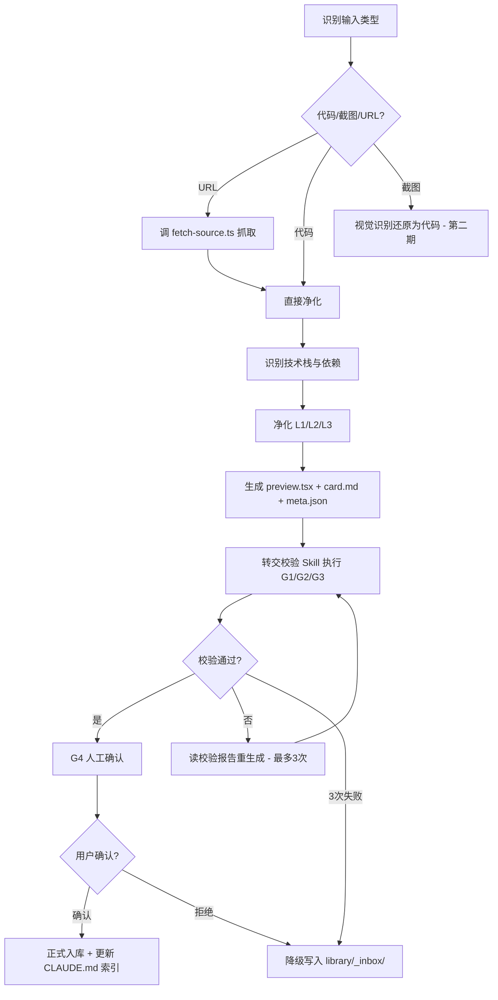

# 入库 Skill

> **核心职责**：将用户发来的组件素材整理入库。端到端编排，校验环节转交校验 Skill。
> **关键约束**：URL 模式下 AI **禁止自己 fetch**，必须调 `.trae/skills/component-ingest/scripts/fetch-source.ts`。

## 一、流程总览



## 二、分步执行

### 步骤 1：识别输入类型
- **代码粘贴**：用户直接贴源码 → **将原始代码保存到 `<组件目录>/_source/original-source.tsx`**（或 `.html`/`.vue`，按实际扩展名），`meta.json.sourceType = "pasted-code"` → 进入步骤 3
- **URL**：用户给链接 → 判断 URL 类型
  - **21st.dev URL**（含 `21st.dev`）→ 进入步骤 2a（Registry 源码获取，优先）+ 步骤 2b（视觉基线抓取，并行）
  - **其它 URL** → 进入步骤 2b（仅抓取，可能需步骤 3.5 还原）
- **截图**：第二期实现，第一期提示用户改用 URL/代码模式

> **sourceType 决定校验分级**：`pasted-code`/`registry-source` 有真实源码（`_source/original-source.*`），G3 可做实现保真度对比；`rendered-dom`/`screenshot-restore` 无真实源码，G3 标注 skipped、overall 最高为 warn。务必在步骤 1/2a 正确设置 sourceType 并留存真实源码。

### 步骤 2a：Registry 源码获取（仅 21st.dev URL）
21st.dev 组件源码走 `/r/registry` API，`fetch-source.ts` 抓不到真实源码（只抓渲染后 DOM）。必须优先用 `npx shadcn@latest add` 拿真实源码。

**AI 执行流程**：
1. 从 URL 提取 registry 路径：`https://21st.dev/@{author}/components/{slug}` → `https://21st.dev/r/{author}/{slug}`
2. **向用户确认**（高风险：会修改项目 package.json / node_modules）：
   ```
   即将执行：npx shadcn@latest add "https://21st.dev/r/{author}/{slug}"
   该命令会安装组件源码 + 依赖到当前项目。
   ```
3. 用户确认后执行：
   ```bash
   npx shadcn@latest add "https://21st.dev/r/{author}/{slug}"
   ```
4. shadcn 会把组件源码写到项目某处（通常是 `components/ui/` 或当前目录），AI 读取该源码作为 `index.tsx` 基础
5. **将真实源码副本保存到 `<组件目录>/_source/original-source.tsx`**（G3 实现保真度对比的权威基准，无此文件则 G1 报 `source-missing`），`meta.json.sourceType = "registry-source"`
6. 进入步骤 3（识别技术栈与依赖）

**失败处理**：shadcn add 失败（网络/登录/组件不存在）时，降级到步骤 3.5 还原模式，`meta.json.sourceType = "rendered-dom"`，必须在 card.md 标注"还原实现，非原始源码，还原可能偏离真实逻辑"（G1 会校验此标注存在）。

### 步骤 2b：视觉基线抓取（URL 模式必备）
**必须调用脚本，禁止 AI 自己 fetch**：
```bash
npx tsx .trae/skills/component-ingest/scripts/fetch-source.ts --url "<URL>" --out "<组件目录>/_source/"
```
脚本一次会话产出（存入 `_source/`）：
- `original.html` - 组件 HTML（21st.dev：iframe 内 #root 渲染后 DOM；其它站点：组件容器或整页）
- `original.png` - 组件截图（21st.dev：iframe 截图；其它：组件元素或整页）— **G2 渲染对比基线**
- `demo-code.txt` - 调用示例代码（仅 21st.dev 模式产出，是 `import Component from ...` 的使用示例）
- `network.json` - 网络日志（用于反推 CDN 依赖）
- `console.json` - 控制台日志
- `metadata.json` - 抓取元信息（URL/时间/captureMode/sourceType/dependencies/demoCode/jsonLd/registryHint）

**抓取策略**（脚本自动选择，优先级从高到低）：
1. **21st.dev 专用分支**：检测到 URL 含 `21st.dev` 时，进入预览 iframe 抓取 `#root` 的渲染后 DOM，从 iframe 内 `<script src>` 提取组件依赖（如 three.js），从主页面 `div.code-wrapper-vesper` 提取 demoCode，从 JSON-LD 提取组件元信息（name/description/author）。`captureMode: "21st-iframe"`，`sourceType: "rendered-dom"`，`registryHint: "npx shadcn@latest add '<registry-url>'"`
2. **通用选择器探测**：非 21st.dev 站点，按 `autoDetectSelector` 启发式探测组件容器。`captureMode: "component"`
3. **整页兜底**：以上均失败时抓整页。`captureMode: "fullpage"`

**关键约束**：
- 21st.dev 的渲染后 DOM **不含 JS 逻辑**（shader/动画/状态切换），仅作 G2 视觉对比基线 + 依赖反推，**不能作为组件源码**
- 非 21st.dev 站点若抓到的是渲染后 DOM，需在步骤 3.5 还原

可选参数：
- `--selector "<CSS>"` - 指定组件容器选择器（覆盖自动探测，仅对非 21st.dev 站点生效）
- `--wait "<ms>"` - 额外等待时长（默认 1500ms）

### 步骤 3：识别技术栈与依赖
- 检测 React / Vue / HTML / 可视化（Three.js / Canvas / SVG）
- **21st.dev 模式**：直接读 `metadata.json` 的 `dependencies` 字段（脚本已从 iframe script src 提取，如 `three.min.js`），读 `jsonLd` 获取组件名/描述/作者
- **其它模式**：结合 `network.json` 反推 CDN 依赖（如发现 `cdn.jsdelivr.net/npm/framer-motion` 则加依赖）
- 提取依赖写入 `meta.json` 的 `dependencies` 字段
- 字体依赖：从 HTML `<link>` 检测 Google Fonts，写入 `meta.json` 的 `fonts` 字段

### 步骤 3.5：还原组件代码（仅 sourceType=rendered-dom 时，高风险兜底）
当 `metadata.json` 的 `sourceType` 为 `rendered-dom` 且步骤 2a 失败（或非 21st.dev 站点抓到渲染后 DOM）时，AI 需还原成可维护的组件源码。

> ⚠️ **高风险警示**：还原模式基于渲染后 DOM 反推源码，**JS 逻辑（shader/动画/状态切换/事件监听）无法还原**，极易偏离真实实现。V1 验证案例：Modern Login & Signup 还原版把 ShaderMaterial 2D 点阵动画猜成"3D 漂浮粒子"，完全错误，且漏掉登录/注册双态切换。**仅在步骤 2a 失败且用户接受还原风险时使用**。

**还原步骤**：
1. 读取 `original.html`（渲染后 DOM）和 `original.png`（视觉参考）
2. 分析 DOM 结构，识别组件的 HTML 骨架 + 内联样式
3. 将内联 style 还原为 Tailwind class 或 CSS（优先 Tailwind）
4. 将 canvas/svg 等特殊元素保留为对应 React 组件（注：canvas 的 WebGL/shader 逻辑无法还原，只能用 placeholder 或简化实现）
5. 将硬编码文案提取为 Props
6. 参考 `demo-code.txt` 了解组件的预期用法（如 `<Component />` 无 props）
7. 产出还原后的 `index.tsx`，进入步骤 4 净化

**强制标注**：还原模式产出的 card.md 必须在"实现说明"章节首行标注：
```
> ⚠️ 还原实现，非原始源码。JS 逻辑（动画/状态切换）为基于 DOM 的视觉反推，可能与原组件行为不一致。
```
meta.json 的 `sourceType` 字段填 `rendered-dom`（区别于 `registry-source` 的真实源码）。

### 步骤 4：净化代码（L1/L2/L3 规则）

**L1 必须移除**（业务污染）：
- `console.log` / `debugger` / 测试代码
- 硬编码 API 地址、token、用户 ID
- 业务特定的环境检测代码
- 与组件无关的第三方分析代码

**L2 必须保留**（组件灵魂）：
- 核心样式（含 CSS 变量、keyframes 动画）
- 核心交互逻辑（鼠标视差、动画控制、事件监听）
- 特殊技术实现（SVG filter、Canvas 绘制、WebGL）
- TypeScript 类型定义
- 防御性编程逻辑（如 `useMemo` 防 hydration 错误）

**L3 规范化**（统一格式）：
- Prettier 统一格式（解决源码压缩问题）
- 目录改 kebab-case，组件名改 PascalCase
- Google Fonts 在线导入：**保留**，card.md 标注字体依赖
- 硬编码文案：提取为 Props（如 `title`、`placeholder`）
- 硬编码颜色：提取为 Props 或保留 CSS 变量
- 文件头注释：来源、原作者、入库日期、原始 URL
- 依赖写入 meta.json，不在组件内 import 业务模块

### 步骤 5：生成产物
在 `library/{techStack}/{category}/{component-name}/` 下生成：

| 文件 | 内容 |
|------|------|
| `index.tsx` / `index.html` / `index.vue` | 净化后的组件源码 |
| `preview.tsx` | 预览入口（供校验 Skill 沙箱渲染 + 预览应用展示） |
| `card.md` | AI 卡片：元数据 + 视觉描述 + Props + 示例 + 源码相对路径（模板见 `docs/ai-card-template.md`） |
| `meta.json` | 元数据（结构见 PRD 5.3 节） |

**meta.json 必填字段**：`id` / `name` / `techStack` / `category` / `tags` / `dependencies` / `source` / `sourceUrl` / `sourceType` / `createdAt`

**六维标签生成**（tags 字段，每维度 ≥2，总数 8-15）：
- 功能（button/input/modal/nav/login）
- 风格（glow/gradient/glassmorphism/neon/minimal）
- 情绪（energetic/calm/playful/serious/mysterious）
- 场景（cta/hero/onboarding/dashboard/auth）
- 技术（framer-motion/gsap/css-only/svg-filter/canvas）
- 灵感（futuristic/retro/organic/geometric/cyberpunk）

**归一化**：`btn`→`button`，`按钮`→`button`，英文为主中文为辅。

### 步骤 6：转交校验 Skill
**AI 行为**：停止入库流程，转去读 `.trae/skills/component-validate/SKILL.md`，按其流程执行 G1/G2/G3 三层校验，等待校验报告返回。

转交时需告知校验 Skill：
- 组件目录路径
- `meta.json.sourceType`（决定 G3 校验分级：有真实源码做保真度对比 vs 无源码标注 skipped）
- 是否有 `_source/original-source.*`（真实源码，`registry-source`/`pasted-code` 模式必备，G3 实现保真度对比基准）
- 是否有 `_source/original.png`（决定 G2 是否做双图对比）

### 步骤 7：根据校验报告决策
读取校验 Skill 返回的 JSON 报告：
- **`overall: pass`** → 进入步骤 8（G4 人工确认）
- **`overall: fail/warn`** → 读 `errors` / `g2.diffPath` / `g3.risks`，针对性重生成产物，回到步骤 6 重校（最多 3 次）
- **3 次仍失败** → 进入降级流程

### 步骤 8：G4 人工确认
向用户展示四件东西：
1. 渲染预览（启动预览应用或沙箱截图）
2. 净化前后 diff（关键差异说明）
3. AI 卡片摘要（card.md 内容）
4. 校验自评报告（G3 的 risks 清单）

询问用户：
- 确认入库 → 进入步骤 9
- 拒绝 → 降级写入 `_inbox/` 或丢弃
- 调整分类 → 用户指定后进入步骤 9

### 步骤 9：入库 + 更新索引
- 推荐分类目录（按 `techStack + category`）
- 用户确认后，产物落到最终目录
- 更新 `CLAUDE.md` 的组件索引清单（如已维护）
- 告知用户入库结果：组件路径、卡片路径、预览方式

## 三、变体判断逻辑

入库时若发现库中已有同名/相似组件：
1. **仅样式/配色差异** → 作为变体加入 `variants/`，更新父组件 `meta.json` 的 `variants` 字段
2. **实现逻辑差异大** → 作为独立组件 + `meta.json` 含 `relatedComponents` 关联
3. **无法判断** → 询问用户决定

## 四、失败降级

连续失败（G1/G2/G3 重试均不过）：
1. 把当前产物 + 失败日志写入 `library/_inbox/{timestamp}-{slug}/`
2. 失败日志 `ingest-log.json` 记录：
   - 失败的 Gate（G1/G2/G3）
   - 失败原因（errors / diffPath / risks）
   - 重试次数
   - 原始素材路径
3. 告知用户"N 个组件待人工处理"，可在预览应用或 `_inbox/` 目录查看

## 五、入库后纠错（事后发现错误）

预览应用"反馈问题"按钮触发三种动作：
- **重新净化**：保留 `_source/`，重跑步骤 4-9
- **重新生成卡片**：保留源码，重跑步骤 5 的 card.md + 步骤 6 的 G3 自评
- **标记删除**：移入 `library/_archive/`（git 可追溯）

## 六、输出物清单

入库成功后，组件目录应包含：
```
library/{techStack}/{category}/{component-name}/
├── index.tsx              # 源码
├── preview.tsx            # 预览入口
├── card.md                # AI 卡片
├── meta.json              # 元数据
└── _source/               # 素材留存（代码/URL 模式均有）
    ├── original-source.tsx  # 真实源码（pasted-code/registry-source 模式，G3 保真度对比基准）
    ├── original.html        # 渲染后 DOM（URL 模式，仅视觉参考）
    ├── original.png         # 原页截图（G2 对比基线）
    ├── rendered.png         # G2 起播帧截图
    ├── rendered-stable.png  # G2 稳定帧截图（供 G3 分析动画/状态切换）
    ├── diff.png             # G2 像素差异图
    ├── network.json
    ├── console.json
    ├── metadata.json
    └── ingest-log.json      # 入库日志（含校验报告）
```

## 七、批量入库

批量场景调 `.trae/skills/component-ingest/scripts/batch-ingest.ts`：
```bash
npx tsx .trae/skills/component-ingest/scripts/batch-ingest.ts --input .trae/skills/component-ingest/.batch/fetch-result.json
```
脚本会：
1. 读取抓取产物清单
2. 为每个组件生成"入库任务卡"（结构化指令）
3. 输出 `.trae/skills/component-ingest/.batch/ingest-tasks.json` 给 AI 按本 Skill 流程逐个处理
4. AI 处理每个任务时仍需走完整 G1-G4 流程

AI 拿到任务清单后，逐个按本 Skill 流程处理，每处理完一个更新任务状态。
