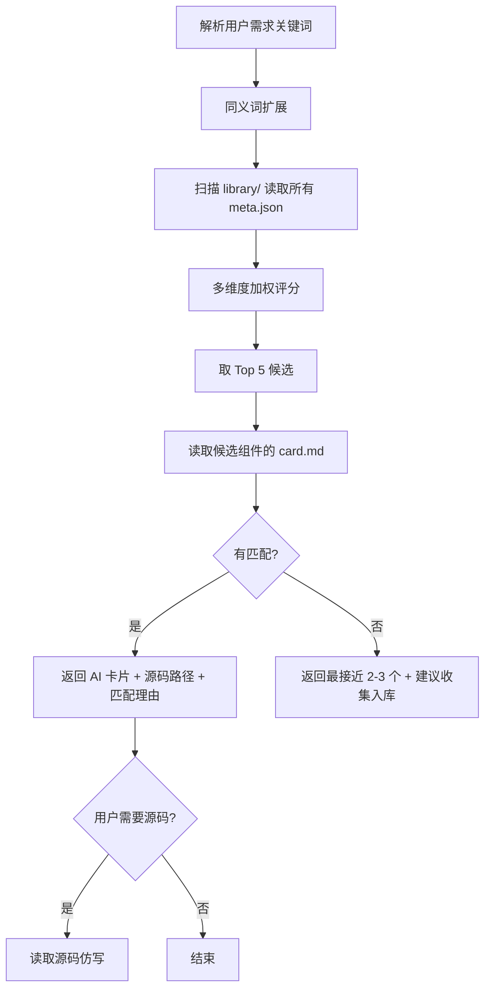

# 检索 Skill

> **核心职责**：根据用户需求检索匹配组件，返回 AI 卡片摘要 + 源码相对路径，最大限度节约上下文。

## 一、流程总览



## 二、分步执行

### 步骤 1：解析用户需求关键词
从用户描述中提取四类关键词：
- **功能词**：如"按钮""表单""导航""登录"
- **风格词**：如"发光""玻璃态""暗色""渐变"
- **情绪词**：如"赛博朋克""未来感""活泼""严肃"
- **技术栈偏好**：如"React""带动画""用 framer-motion"

### 步骤 2：同义词扩展
查询同义词词典 `src/lib/synonyms.json`，扩展关键词：
- "按钮" → `button` / `btn` / `按键`
- "输入框" → `input` / `textfield` / `输入`
- "登录" → `login` / `signin` / `auth`
- "发光" → `glow` / `光晕` / `荧光`
- "赛博朋克" → `cyberpunk` / `赛博`

### 步骤 3：扫描组件库
读取 `library/` 下所有组件的 `meta.json`（忽略 `_inbox/` `_archive/` `_source/`）。
提取每个组件的 `id` / `name` / `techStack` / `category` / `tags` / `dependencies` / `sourceType`。

### 步骤 4：多维度加权评分

**评分公式**：
```
总分 = (tags命中数 × 3 + category匹配 × 2 + 技术栈匹配 × 2 + 视觉描述关键词重叠 × 1) × 可信度系数
```

| 维度 | 权重 | 匹配规则 |
|------|------|---------|
| tags 命中 | ×3 | 精确匹配 + 同义词扩展，命中数越多分越高 |
| category 匹配 | ×2 | 完全匹配得 2 分，不匹配得 0 分 |
| 技术栈匹配 | ×2 | 用户项目是 React 则 react 组件优先 |
| 视觉描述重叠 | ×1 | 读 card.md 视觉描述中的关键词重叠数 |
| **可信度系数** | ×sourceType | `registry-source` ×1.0 / `pasted-code` ×0.9 / `rendered-dom` ×0.7 / `screenshot-restore` ×0.5 |

> **可信度系数说明**：还原实现（`rendered-dom`/`screenshot-restore`）的组件逻辑可能偏离真实实现（V1 教训：还原版把 shader 点阵猜成 3D 粒子、漏掉登录/注册切换），排序时降权，优先推荐有真实源码验证过的组件。读取 `meta.json.sourceType` 获取系数。

**变体与关联组件处理**：
- 若匹配到含 `variants` 的组件，返回时附带变体列表
- 若匹配到含 `relatedComponents` 的组件，一并返回关联组件

### 步骤 5：读取 Top 5 候选的 card.md
- 默认返回 Top 5
- 用户说"再多几个"扩展到 Top 10
- 读取候选组件的 `card.md`，匹配视觉描述与适用场景

### 步骤 6：返回结果

**有匹配时**返回格式：
```
找到 N 个匹配组件（按相关度排序）：

1. [组件名] - [一句话描述]
   匹配理由：tags 命中 button + glow + cyberpunk
   可信度：registry-source（真实源码，已验证）
   卡片：library/.../card.md
   源码：library/.../index.tsx

2. [组件名] - [一句话描述] ⚠️还原实现
   匹配理由：tags 命中 glow + neon
   可信度：rendered-dom（还原实现，逻辑可能偏离真实组件，仿写需人工核对）
   卡片：library/.../card.md
   源码：library/.../index.tsx
```

> **还原实现标注**：`sourceType` 为 `rendered-dom`/`screenshot-restore` 的组件在名称后标 ⚠️，可信度行注明"还原实现，逻辑可能偏离"。AI 仿写此类组件时需提醒用户核对核心逻辑。

**无匹配时**兜底：
- 告知用户库中暂无匹配
- 提供最接近的 2-3 个组件（即使分数低）
- 建议用户收集后入库（指向 `docs/组件URL收集清单.md`）

### 步骤 7：按需读取源码仿写
- 默认只返回 AI 卡片摘要（节约上下文）
- 用户要求"看源码"或 AI 判断需要仿写时，读取 `index.tsx`
- 仿写时遵循原组件的样式与交互逻辑，适配用户项目的技术栈与设计系统

## 三、返回数量与排序

- **默认**：Top 5
- **扩展**：用户说"再多几个"扩展到 10
- **排序**：按总分降序，同分按 `updatedAt` 降序（新组件优先）

## 四、同义词词典

词典文件：`src/lib/synonyms.json`（第一期维护约 50 个常见词）

示例结构：
```json
{
  "button": ["按钮", "btn", "按键"],
  "input": ["输入框", "textfield", "输入"],
  "modal": ["弹窗", "对话框", "dialog"],
  "nav": ["导航", "navigation", "菜单"],
  "login": ["登录", "signin", "auth"],
  "glow": ["发光", "光晕", "荧光"],
  "gradient": ["渐变", "过渡色"],
  "cyberpunk": ["赛博朋克", "赛博"],
  "futuristic": ["未来感", "未来", "科幻"]
}
```

词典可后续扩充，不影响 Skill 逻辑。

## 五、注意事项

- **优先返回卡片**：避免直接读源码占用上下文，卡片摘要足以让 AI 判断是否需要进一步读源码
- **路径用相对路径**：返回的卡片/源码路径均为相对项目根的路径
- **说明匹配理由**：每次返回都说明"为什么匹配"，帮助用户理解检索结果
- **跨类别返回**：tags 命中可跨 category 返回（如"赛博朋克"可匹配 ui-basic 的 glow button 和 effects 的 neon background）
- **披露可信度**：返回结果必须标注 `sourceType`，还原实现（`rendered-dom`/`screenshot-restore`）标 ⚠️，让 AI/用户知晓逻辑保真风险后再决定是否仿写
