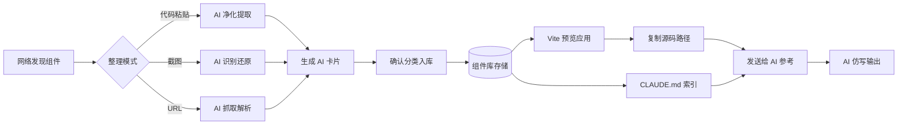
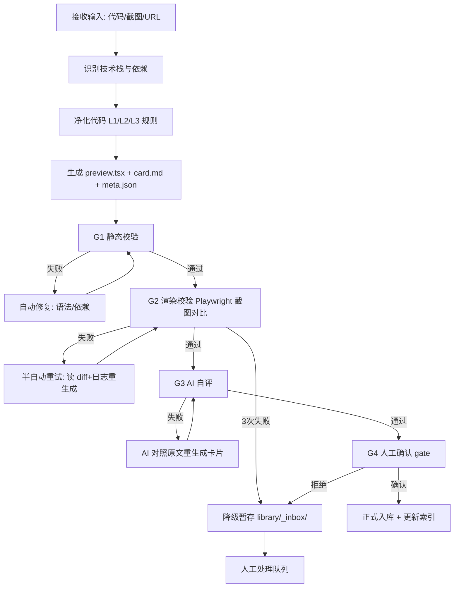
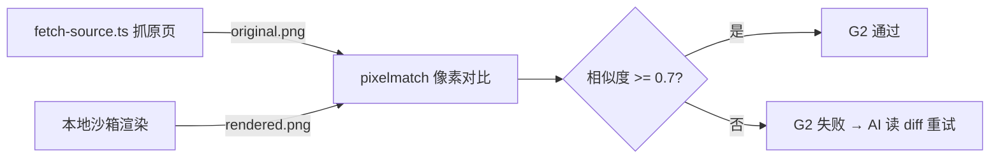
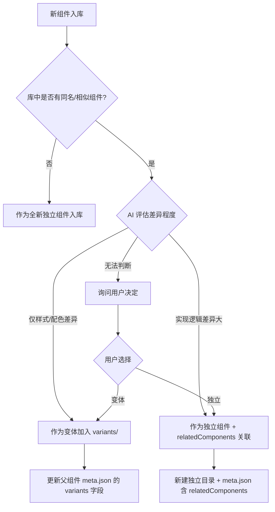
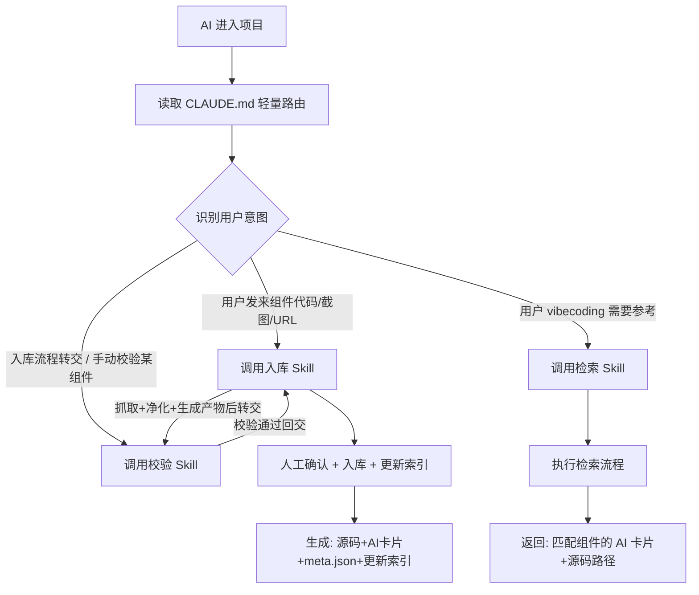
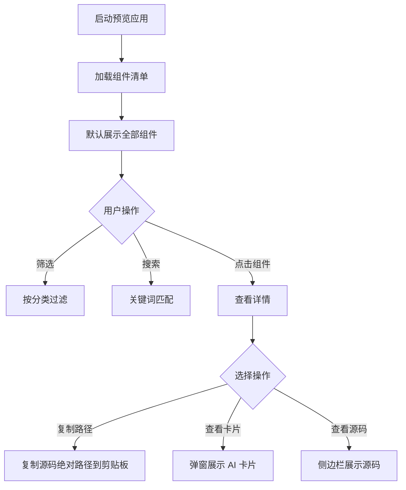

# 本地组件知识库 产品需求文档（PRD）

> **文档版本**：v0.3（Skill 目录化落地 + 脚本下沉各 Skill + 批量脚本 + 步骤3.5还原逻辑）
> **创建日期**：2026-06-30
> **文档状态**：待评审
> **文档作者**：产品经理视角整理
> **变更说明**：
> - v0.1 仅"AI 整理 + 用户确认"单线流程
> - v0.2 针对AI录入随机性新增四层校验 gate（G1静态/G2渲染/G3自评/G4人工）+ 三 Skill 架构（入库/校验/检索）+ Playwright 抓取与双截图对比机制
> - v0.3 落地实现同步：Skill 从 `.claude/skills/*.md`（单文件）改为 `.trae/skills/component-*/`（目录化，含 SKILL.md + scripts/ + .batch/）；脚本从项目根 `scripts/` 下沉到各 Skill 目录内；新增批量预处理脚本（batch-fetch/batch-ingest/batch-validate）；入库 Skill 补充步骤 3.5"渲染后 DOM 还原为源码"；抓取产物补全 demo-code.txt/metadata.json；截图模式第一期不做（已确认为决策，从待确认移入已确认）

---

## 1. 项目概述

### 1.1 背景

**痛点**：在 vibecoding（AI 辅助编码）过程中，AI 直接输出的组件效果不佳——样式粗糙、交互僵硬、动效缺失。根源在于 AI 缺乏高质量的本地参考素材，仅凭描述难以复刻网络上的优秀组件。

**契机**：用户在网络浏览时经常会看到优秀的组件，但缺乏系统化的收集、整理与检索机制，导致这些素材散落各处，无法被 AI 有效利用。

### 1.2 目标

构建一个**本地组件知识库**，类比 Obsidian 个人知识库，实现「**收集 → 整理 → 预览 → 给 AI 参考**」的完整闭环，让 AI 在生成组件时能精准参考本地高质量素材，显著提升输出质量。

### 1.3 核心价值

| 价值维度 | 说明 |
|---------|------|
| **质量提升** | AI 参考本地组件后，输出从「凭空生成」升级为「仿写优化」 |
| **上下文节约** | 通过 AI 卡片摘要机制，避免直接喂入完整源码占用上下文 |
| **资产沉淀** | 个人组件资产持续积累，越用越强 |
| **跨会话复用** | 通过 CLAUDE.md 索引 + 文件路径引用，打破会话限制 |

### 1.4 名词约定

- **组件（Component）**：可复用的 UI 单元，含源码 + 元数据 + 预览
- **AI 卡片（AI Card）**：每个组件的精简摘要文件，供 AI 快速理解
- **CLAUDE.md**：项目根目录的索引文件，AI 进入项目时自动读取
- **Skill**：封装检索逻辑的项目级技能（第二期实现）

---

## 2. 用户画像与使用场景

### 2.1 用户画像

**主要用户**：个人开发者（vibecoding 实践者）
- 熟悉前端开发，但希望 AI 承担更多编码工作
- 审美在线，对组件视觉效果有要求
- 不愿长期在同一会话中维护组件库

### 2.2 核心使用场景

**场景 A：发现优秀组件**
> 用户在 21st.dev、Magic UI、CodePen 等平台看到心仪组件 → 复制代码/截图/URL → 发送给 AI → AI 整理入库 → 自动生成 AI 卡片

**场景 B：vibecoding 时参考组件**
> 用户在新会话中开发项目 → AI 读取 CLAUDE.md 索引 → 用户告知需求 → AI 检索匹配组件 → 读取 AI 卡片 → 必要时读取源码 → 仿写适配

**场景 C：本地预览选型**
> 用户启动 Vite 预览应用 → 分类筛选/搜索 → 找到合适组件 → 一键复制源码路径 → 粘贴给 AI 让其参考

### 2.3 工作流总览



---

## 3. 功能需求

### 3.1 组件收集与整理

**支持四种收集模式**（用户已确认全要）：

| 模式 | 输入 | AI 处理 | 适用场景 | sourceType |
|------|------|---------|---------|-----------|
| **Registry 源码获取** | 21st.dev 等 registry URL | AI 执行 `npx shadcn@latest add <url>`（需用户确认）拿真实源码 + 调 fetch-source.ts 抓原页截图作 G2 对比基线 | 21st.dev 组件（URL 含 21st.dev） | `registry-source` |
| **代码粘贴模式** | 用户粘贴原始组件代码 | 净化去杂、提取依赖、规范命名 | 从 21st.dev/Magic UI 复制源码、shadcn add 后贴回 | `pasted-code` |
| **截图模式** | 用户上传组件截图 | 视觉识别还原为代码 | 看到 Dribbble/Twitter 设计稿 | `screenshot-restore` |
| **URL 抓取模式** | 用户提供页面 URL | 抓取页面、提取目标组件 | 看到 CodePen/博客演示 | `rendered-dom` |

> **Registry 优先原则**：检测到 21st.dev URL 时，必须优先尝试 Registry 源码获取模式（拿真实源码），fetch-source.ts 仅作视觉基线抓取（original.png 供 G2 对比）。还原模式（步骤 3.5）风险极高，仅作最后兜底。

**整理流程**（AI 整理 + 四层校验 gate + 用户确认）：

> AI 录入具有随机性，单凭"AI 整理 → 用户肉眼确认"会让知识库逐渐污染。本流程在 AI 产出与人工确认之间插入四道自动校验 gate，机器可判定的靠脚本、语义可判定的靠渲染截图对比 + AI 自评，最终由人工 gate 兜底。详见 [3.1.2 验证纠错机制](#312-验证纠错机制四层校验-gate)。



**关键约束**：URL 模式下 AI **禁止自己 fetch 抓页面**，必须调用 `.trae/skills/component-ingest/scripts/fetch-source.ts`（Playwright 一次会话产出 HTML + 原页截图 + 网络日志 + 控制台日志）。AI 只负责编排流程与决策，抓取/校验逻辑下沉为可复用脚本。详见 [3.5 节 Skill 与脚本职责划分](#35-ai-参考机制)。

#### 3.1.1 净化规则定稿（基于 21st 真实样本）

> 本规则基于分析 [21st Neural Access Login](https://21st.dev/community/components/shivendra9795kumar/neural-access-login/default) 组件后定稿。该样本特征：React + TypeScript、内联 `<style>` + CSS 变量、纯 CSS 动画 + JS 视差、SVG gooey filter、无 Props 硬编码、代码压缩在一行。

**L1 必须移除**（业务污染）

- `console.log` / `debugger` / 测试代码
- 硬编码 API 地址、token、用户 ID
- 业务特定的环境检测代码
- 与组件无关的第三方分析代码

**L2 必须保留**（组件灵魂）

- 核心样式（含 CSS 变量、keyframes 动画）
- 核心交互逻辑（鼠标视差、动画控制、事件监听）
- 特殊技术实现（SVG filter、Canvas 绘制、WebGL）
- TypeScript 类型定义
- 防御性编程逻辑（如 `useMemo` 防 hydration 错误）

**L3 规范化**（统一格式）

- 用 Prettier 统一格式（解决 21st 组件代码压缩问题）
- 目录改 kebab-case，组件名改 PascalCase
- Google Fonts 在线导入：**保留**，card.md 标注字体依赖
- 硬编码文案：提取为 Props（如 `title`、`placeholder`）
- 硬编码颜色：提取为 Props 或保留 CSS 变量
- 文件头注释：来源、原作者、入库日期、原始 URL
- 依赖写入 meta.json，不留在组件内 import 业务模块

**净化示例**（基于 Neural Access Login）

```
原组件问题：
- 代码压缩在一行 → Prettier 格式化
- 硬编码 "NEURAL ACCESS" → 提取为 title Prop
- 硬编码 "User Identity" → 提取为 label Prop
- Google Fonts 在线导入 → 保留，card.md 标注
- SVG gooey filter → 保留（核心效果）
- useMemo 防 hydration → 保留（防御性逻辑）
```

#### 3.1.2 验证纠错机制（四层校验 gate）

> 解决 AI 录入随机性问题的核心。机器可判定的靠脚本，语义可判定的靠渲染截图对比 + AI 自评，最终由人工 gate 兜底。

**AI 录入在 7 个环节都可能出错**：

| 环节 | 典型错误 | 严重度 |
|------|---------|--------|
| ① URL 抓取 | 抓到导航/广告/多组件混杂、SPA 渲染内容丢失 | 致命 |
| ② 技术栈识别 | 漏依赖、误判 React/Vue | 高 |
| ③ 净化 | 过度删除 keyframes/SVG filter（组件灵魂丢失）；不足残留 token/console | 致命 |
| ④ AI 卡片 | 视觉描述与实际不符、Props 类型错、示例跑不起来 | 中 |
| ⑤ meta.json | 字段缺失、tags 漏标、分类错 | 中 |
| ⑥ 目录命名 | 非 kebab-case、放错 category | 低 |
| ⑦ 索引更新 | CLAUDE.md 重复条目、相对路径错 | 低 |

**四层 gate**（按 `sourceType` 分级：`registry-source`/`pasted-code` 有真实源码可做实现保真度对比；`rendered-dom`/`screenshot-restore` 无真实源码，overall 最高为 warn，强制 G4 人工把关）：

| Gate | 校验内容 | 方式 | 失败处理 |
|------|---------|------|---------|
| **G1 静态校验** | TS 编译、meta.json Schema（含 `sourceType` 枚举）、card.md frontmatter、grep 黑名单、依赖一致性、**还原模式警示标注**、**真实源码留存校验** | `.trae/skills/component-validate/scripts/validate-component.ts` | 自动修复（语法/依赖），最多 3 次 |
| **G2 渲染校验** | 沙箱路由渲染不报错 + **多帧截图**（起播帧 + 稳定帧）pixelmatch 对比（相似度 ≥ 0.7）+ **可交互元素探测** | `.trae/skills/component-validate/scripts/screenshot-diff.ts` + 预览应用 `/__sandbox__/:id` 路由 | 半自动重试（AI 读 diff.png + 渲染错误日志重生成），最多 3 次 |
| **G3 AI 自评** | 视觉描述一致性、Props 覆盖度、tags 六维 ≥2、分类合理性 + **实现保真度检查**（有真实源码则逐项对比核心技术/状态管理/交互/props；无源码标注 skipped） | AI 二次调用，输出自评报告 | AI 对照原文重生成卡片，最多 2 次 |
| **G4 人工确认** | 用户看到：渲染预览 + 净化前后 diff + AI 卡片摘要 + 自评报告（含保真度结论） | 预览应用 UI | 拒绝则降级暂存或丢弃 |

> **V1 教训驱动的设计**：还原版曾通过 G1/G2/G3 但把 ShaderMaterial 2D 点阵猜成 3D 粒子、漏掉登录/注册切换。根因：G1 只查形式不查实现、G2 单帧截图看不到状态切换、G3 对照渲染后 DOM（不含 JS 逻辑）导致同源偏差。现按 sourceType 分级 + G3 实现保真度检查根治此问题。

**G2 渲染校验关键设计**（最关键的一层，证明"净化没破坏组件"）：



- **原页截图**：URL 模式下由 `fetch-source.ts` 一次会话同步产出；代码粘贴/截图模式无原页截图时，G2 退化为"仅渲染不报错即通过"
- **本地渲染截图**：Playwright 访问预览应用沙箱路由 `/__sandbox__/:componentId`（纯白背景、无应用 chrome），React error boundary 注入 `data-render-error` 属性供脚本判定
- **相似度阈值 0.7**：经验值，过低漏检、过高误报，可后续调整
- **统一基线**：截图尺寸 1280×800，动画等待 1.5s（覆盖大多数 CSS 动画起播）
- **diff.png 留存**：用户在 G4 确认时能直接看差异图，比相似度数字更直观
- **多帧截图**：起播帧（t=1.5s）+ 稳定帧（t=3s），双帧供 G3 分析动画类型是否一致——V1 教训：单帧无法区分"波纹扩散"vs"漂浮粒子"
- **可交互元素探测**：扫描 button/a/role=button 等输出 `interactiveElements` 清单，供 G3 检查还原版是否实现了真实源码的所有交互入口——V1 教训：还原版漏掉登录/注册切换按钮

#### 3.1.3 修复机制（三级 + 兜底）

| 级别 | 触发 | 动作 | 次数上限 |
|------|------|------|---------|
| 自动修复 | G1 失败（语法/依赖） | AI 读报错 → 改 → 重校 | 3 次 |
| 半自动重试 | G2 失败（渲染/截图差异） | AI 读 error boundary 日志 + diff 区域 → 重生成 preview.tsx | 3 次 |
| 降级暂存 | 连续失败 / 截图相似度极低 | 写入 `library/_inbox/{timestamp}-{slug}/`，附失败日志 `ingest-log.json` | — |

**`_inbox` 兜底队列**：预览应用首页置顶提示"N 个组件待人工处理"，用户可查看失败原因、重新触发入库或删除。

#### 3.1.4 入库后纠错（事后发现错误）

预览应用每个组件卡片加 **"反馈问题"按钮**，触发三种动作：

- **重新净化**：保留 `_source/` 原始素材，重跑净化流程
- **重新生成卡片**：保留源码，重跑 G3 自评
- **标记删除**：移入 `library/_archive/`（git 可追溯）

**原始素材留存**：每次入库把"URL 抓取的原始 HTML + 原始截图 + 网络/控制台日志"存到组件目录的 `_source/` 子目录，作为后续纠错的重放基准。

### 3.2 组件存储与分类

**多技术栈混合存储**，按技术栈顶层隔离：

- React + TypeScript
- 原生 HTML/CSS/JS
- Vue 3 + TypeScript
- 动效/可视化（Three.js / Canvas / SVG）

**组件粒度分类**（用户已确认）：

- UI 基础组件（按钮、输入框、Modal 等）
- 业务组件块（卡片、导航、表单组等）
- 动效/交互效果（悬停、滚动、过渡等）

**预装依赖**（避免 AI 参考时缺库）：

- `framer-motion`（即 `motion`）
- `gsap`
- `lottie-react`
- `three.js` / `@react-three/fiber`

> 详细目录结构见 [第 5.2 节](#52-目录结构设计)。

### 3.3 变体混合方案（独立组件 + 多变体关联）

**核心策略**：入库时 AI 判断新组件与已有组件的差异程度，决定作为"变体"还是"独立组件 + 关联"。

#### 判断逻辑



#### 目录结构示例

```
library/react/ui-basic/
├── button/                      # 按钮组件（多变体）
│   ├── index.tsx                # 基础按钮（可选）
│   ├── variants/
│   │   ├── glow.tsx             # 发光变体（小差异）
│   │   ├── gradient.tsx         # 渐变变体（小差异）
│   │   └── neon.tsx             # 霓虹变体（小差异）
│   ├── card.md                  # 统一卡片，含所有变体说明
│   └── meta.json                # 含 variants 列表
│
├── button-magnetic/             # 磁吸按钮（独立，实现差异大）
│   ├── index.tsx
│   ├── card.md
│   └── meta.json                # relatedComponents: ["button"]
```

#### 预览应用适配

- 变体组件卡片显示"3 个变体"徽章
- 点击卡片进入详情页，可切换变体预览
- 详情页侧边栏展示"关联组件"

#### 检索 Skill 适配

```
用户："找按钮组件"
→ 返回 button 组件（含 3 变体）+ button-magnetic（关联）

用户："只要发光的"
→ 返回 button 的 glow 变体
```

### 3.4 标签体系（多维自动生成）

**设计理念**：标签不约束，要发散——让 AI 尽量发掘组件的所有标签，激发用户灵感。

#### 六维标签体系

入库 Skill 自动从 6 个维度生成标签，每维度至少 2 个，总标签数目标 8-15 个：

| 维度 | 示例标签 | 目的 |
|------|---------|------|
| **功能** | button, input, modal, nav, login | 描述"是什么" |
| **风格** | glow, gradient, glassmorphism, neon, minimal | 描述"视觉风格" |
| **情绪** | energetic, calm, playful, serious, mysterious | 描述"情感氛围" |
| **场景** | cta, hero, onboarding, dashboard, auth | 描述"用在哪" |
| **技术** | framer-motion, gsap, css-only, svg-filter, canvas | 描述"技术实现" |
| **灵感** | futuristic, retro, organic, geometric, cyberpunk | 描述"设计灵感" |

#### 标签示例（基于 Neural Access Login）

```
功能: login, form, auth, input
风格: minimal, monochrome, dark
情绪: mysterious, immersive, serious
场景: auth, onboarding, hero
技术: css-keyframes, svg-filter, js-parallax, css-variables
灵感: cyberpunk, futuristic, scifi, liquid, organic
```

#### 防泛滥机制

- **不限制数量**，鼓励发散
- **归一化处理**：`btn`→`button`，`BTN`→`button`，`按钮`→`button`
- **中英文双语**：生成英文标签为主，中文标签为辅（避免检索时遗漏）
- **标签云视图**（第二期）：预览应用展示标签分布，字体大小代表使用频率

#### 检索 Skill 利用标签

```
用户："我想要赛博朋克风格的按钮"
→ 匹配 cyberpunk + button，跨类别返回

用户："给我一些未来感的东西"
→ 匹配 futuristic，返回所有相关组件

用户："登录页面需要点灵感"
→ 匹配 login + auth + onboarding，返回登录类组件
```

### 3.5 AI 参考机制

**架构：CLAUDE.md 轻量路由 + 三 Skill 按需加载**

核心设计思想：CLAUDE.md 极简（只做分发），具体逻辑封装到三个 Skill 中按需加载，最大限度节约上下文与 token 消耗。校验独立成 Skill 是为了支持入库后纠错（[3.1.4](#314-入库后纠错事后发现错误)）与手动复查场景复用同一套校验逻辑。



#### 组件 1：AI 卡片（组件级摘要，存储层）

每个组件维护一个 `card.md` 文件，包含：
- 元数据（技术栈、依赖、分类、标签）
- 视觉描述（供 AI 理解外观）
- 关键 API / Props
- 最小使用示例
- 源码相对路径指引

> 模板见 [第 6.1 节](#61-ai-卡片模板)。AI 卡片是入库 Skill 的产物，经校验 Skill 自评把关，也是检索 Skill 的返回结果。

#### 组件 2：CLAUDE.md 轻量路由（第一期核心）

项目根目录维护 `CLAUDE.md`，**刻意保持精简**（目标 < 50 行），只做三件事：
1. **项目说明**：一句话告知 AI 这是组件知识库
2. **意图分发**：告知 AI 三个 Skill 的存在与触发条件
3. **入口指引**：指向三个 Skill 文件路径

> 模板见 [第 6.2 节](#62-claudemd-轻量路由规范)。

**为什么不把规范全写进 CLAUDE.md？**
> CLAUDE.md 每次会话都会被 AI 自动读取，若塞满规范会持续占用上下文。把详细规范放入 Skill，AI 只在需要时才读取，实现「按需加载」。

#### 组件 3：三 Skill（第一期并行搭建）

> Skill 是给 AI 看的流程指令（markdown），**Skill 之间不能代码级调用**，靠 AI 在读入库 Skill 时遇到"转交点"转去读校验 Skill，执行完回到入库流程继续。AI 只负责编排与决策；抓取/校验逻辑下沉为可复用脚本，保证可测试、可复现、可统一升级。

**入库 Skill**（`.trae/skills/component-ingest/SKILL.md`）
- 触发：用户在对话中发来组件代码 / 截图 / URL
- 职责：端到端编排入库流程（详见 [3.1 节](#31-组件收集与整理)）
  1. **抓取素材**：URL 模式调 `.trae/skills/component-ingest/scripts/fetch-source.ts`（Playwright 一次会话产出 HTML + 原页截图 + 网络/控制台日志）；**禁止 AI 自己 fetch**
  2. 识别技术栈与依赖（结合 network.json 反推 CDN 依赖）
  3. 净化代码（L1/L2/L3 规则）
  4. 生成 preview.tsx + AI 卡片 + meta.json
  5. **转交校验 Skill** 执行 G1/G2/G3，等待校验报告
  6. 根据校验报告决定重试 / 降级暂存 / 进入 G4 人工确认
  7. 用户 G4 确认后入库 + 更新 CLAUDE.md 索引清单
- **fetch-source.ts 归属**：抓取是入库的起点，归入库 Skill；校验 Skill 不抓取只校验
- 支持三种输入模式：代码粘贴 / 截图识别 / URL 抓取
- 失败降级：连续失败写入 `library/_inbox/`（见 [3.1.3 修复机制](#313-修复机制三级--兜底)）

**校验 Skill**（`.trae/skills/component-validate/SKILL.md`）
- 触发：入库 Skill 转交 / 用户手动 `/校验组件 <id>` / 入库后纠错（[3.1.4](#314-入库后纠错事后发现错误)）
- 职责：执行 G1/G2/G3 三层校验，产出校验报告，决定重试或降级
  1. **G1 静态校验**：调 `validate-component.ts`（TS 编译、Schema 含 sourceType 枚举、黑名单、依赖一致性、还原警示标注、真实源码留存校验）
  2. **G2 渲染校验**：调 `screenshot-diff.ts`（沙箱路由多帧截图 pixelmatch 对比 ≥ 0.7 + 可交互元素探测）
  3. **G3 AI 自评**：视觉一致性/Props 覆盖/tags 六维/分类 + **实现保真度检查**（按 sourceType 分级：有真实源码逐项对比核心技术/状态管理/交互/props；无源码标注 skipped），输出自评报告
  4. 汇总三层结果为校验报告（JSON + 人类可读摘要），回交入库 Skill 或展示给用户
- **G3 归属**：G3 需要 AI 推理能力，归校验 Skill 使其完整 owning G1/G2/G3
- 重试循环：G1/G2 失败时由入库 Skill 读报告重生成，校验 Skill 本身无状态不主动重试
- 失败兜底：连续失败由入库 Skill 写入 `library/_inbox/`

**检索 Skill**（`.trae/skills/component-search/SKILL.md`）
- 触发：用户 vibecoding 时描述需求，AI 需要找参考组件
- 职责：执行检索流程
  1. 关键词匹配 meta.json 的 tags 字段
  2. 按 category 分类筛选
  3. 读取候选组件的 card.md
  4. 返回匹配组件的 AI 卡片 + 源码相对路径
  5. 必要时读取源码仿写

**触发方式**：对话自动触发 + 显式调用（如 `/入库组件` `/校验组件` `/检索组件`）均支持。

**脚本清单**（CLI 接口统一 `npx tsx <脚本路径> --param value`，stdout 末尾输出 JSON，进度日志走 stderr）：

> 脚本下沉到各 Skill 目录内的 `scripts/` 子目录，保持 Skill 自包含；批量预处理脚本不属于任何 Skill，由用户/AI 手动触发。

| 脚本 | 归属 | 职责 | 关键产物 |
|------|------|------|---------|
| `.trae/skills/component-ingest/scripts/fetch-source.ts` | 入库 Skill | Playwright 抓原页素材 | `_source/original.html`、`original.png`、`demo-code.txt`、`network.json`、`console.json`、`metadata.json` |
| `.trae/skills/component-validate/scripts/validate-component.ts` | 校验 Skill | G1 静态校验 | JSON 校验报告（TS 编译、Schema 含 sourceType、黑名单、依赖一致性、还原警示、真实源码留存） |
| `.trae/skills/component-validate/scripts/screenshot-diff.ts` | 校验 Skill | G2 渲染校验 | `_source/rendered.png`、`rendered-stable.png`、`diff.png`、相似度分数、`interactiveElements` 清单 |
| `.trae/skills/component-ingest/scripts/batch-fetch.ts` | 批量预处理 | 读 `docs/组件URL收集清单.md` 批量抓取 | `.batch/fetched/{slug}/_source/*`、`.batch/fetch-result.json` |
| `.trae/skills/component-ingest/scripts/batch-ingest.ts` | 批量预处理 | 读抓取产物生成入库任务清单 | `.batch/ingest-tasks.json`（AI 按入库 Skill 逐个处理） |
| `.trae/skills/component-validate/scripts/batch-validate.ts` | 批量预处理 | 扫描 `library/` 生成校验任务清单 | `.batch/validate-tasks.json`（AI 按校验 Skill 逐个处理） |
| `src/lib/registry.ts` | 预览应用 | 扫描组件生成清单 | 预览应用用 registry（PRD 原有） |

**抓取产物说明**（`fetch-source.ts` 一次会话产出，存入 `_source/`）：
- `original.html` - 组件 HTML（21st.dev：iframe 内 #root 渲染后 DOM；其它站点：组件容器或整页）
- `original.png` - 组件截图
- `demo-code.txt` - 调用示例代码（仅 21st.dev 模式产出，是 `import Component from ...` 的使用示例）
- `network.json` - 网络日志（反推 CDN 依赖）
- `console.json` - 控制台日志
- `metadata.json` - 抓取元信息（URL/时间/captureMode/sourceType/dependencies/demoCode/jsonLd）

### 3.4 预览 Web 应用

**形态**：本地 Vite 开发服务器（用户已确认）

**核心功能**：

| 功能 | 说明 | 优先级 |
|------|------|--------|
| 组件展示 | 网格/列表双视图，实时渲染预览 | P0 |
| 分类筛选 | 按技术栈/粒度/标签多层筛选 | P0 |
| 全文搜索 | 搜索组件名、描述、标签 | P0 |
| 复制源码路径 | 一键复制绝对路径，发给 AI | P0 |
| 查看 AI 卡片 | 弹窗展示组件的 AI 卡片内容 | P0 |
| 亮/暗主题切换 | 预览组件在两种主题下的表现 | P1（暂不选） |

**交互流程**：



---

## 4. 非功能需求

### 4.1 性能

- 预览应用启动时间 < 3 秒
- 组件清单加载支持懒加载（组件超过 50 个时）
- 全文搜索响应 < 200ms

### 4.2 可维护性

- 组件入库流程标准化（AI 卡片必填字段校验）
- 目录命名规范统一（kebab-case）
- CLAUDE.md 索引可自动生成（第二期 Skill 实现）

### 4.3 兼容性

- 预览应用支持现代浏览器（Chrome/Edge 最新版）
- 组件源码兼容 Node 18+ / Vite 5+

---

## 5. 技术架构

### 5.1 技术栈选型

| 层级 | 选型 | 理由 |
|------|------|------|
| 预览应用框架 | **Vite + React + TypeScript** | 启动快、HMR、生态成熟 |
| UI 库 | shadcn/ui（可选） | 预览应用自身的 UI |
| 路由 | React Router | 组件详情页路由 |
| 搜索 | flexsearch（轻量） | 本地全文检索 |
| 组件渲染 | 动态 import + React.lazy | 按需加载组件预览 |
| 文档生成 | Vitepress（备选） | 若需静态站点导出 |

### 5.2 目录结构设计

```
c:\000\code\design\
├── CLAUDE.md                      # AI 全局索引（第一期核心，轻量路由）
├── package.json
├── vite.config.ts
├── tsconfig.json
├── docs/                          # 文档目录
│   ├── PRD.md                     # 本文档
│   ├── ai-card-template.md        # AI 卡片模板
│   └── 组件URL收集清单.md          # 批量抓取入口清单（batch-fetch.ts 读取）
├── src/                           # 预览应用源码
│   ├── App.tsx
│   ├── main.tsx
│   ├── components/                # 预览应用自身组件
│   │   ├── ComponentGrid.tsx
│   │   ├── ComponentCard.tsx
│   │   ├── ComponentPreview.tsx   # 组件预览容器（动态 import + 错误边界）
│   │   ├── FilterBar.tsx
│   │   └── SearchBox.tsx
│   ├── pages/
│   │   ├── HomePage.tsx           # 组件列表页
│   │   ├── DetailPage.tsx         # 组件详情页
│   │   └── SandboxPage.tsx        # 沙箱路由 /__sandbox__/:id（供 G2 截图，纯白背景无 chrome）
│   ├── lib/
│   │   ├── types.ts               # 类型定义
│   │   ├── search.ts              # 搜索逻辑
│   │   ├── synonyms.json          # 同义词词典（检索 Skill 用，约 50 词）
│   │   └── mock-data.ts           # Mock 数据
│   └── styles/
├── library/                       # 组件库核心存储
│   ├── react/                     # React 技术栈
│   │   ├── ui-basic/              # UI 基础组件
│   │   │   └── button-glow/
│   │   │       ├── index.tsx      # 组件源码
│   │   │       ├── preview.tsx    # 预览入口
│   │   │       ├── card.md        # AI 卡片
│   │   │       ├── meta.json      # 元数据
│   │   │       └── _source/       # 原始素材（代码/URL 模式留存，供纠错重放）
│   │   │           ├── original-source.tsx  # 真实源码（pasted-code/registry-source，G3 保真度基准）
│   │   │           ├── original.html
│   │   │           ├── original.png
│   │   │           ├── rendered.png         # G2 起播帧
│   │   │           ├── rendered-stable.png  # G2 稳定帧（供 G3 分析动画/状态切换）
│   │   │           ├── diff.png             # G2 像素差异图
│   │   │           ├── demo-code.txt    # fetch-source 产出（21st.dev 模式）
│   │   │           ├── network.json
│   │   │           ├── console.json
│   │   │           ├── metadata.json    # fetch-source 产出（抓取元信息）
│   │   │           └── ingest-log.json  # 入库日志（含校验报告）
│   │   ├── business/              # 业务组件块
│   │   └── effects/               # 动效组件
│   ├── html/                      # 原生 HTML/CSS/JS
│   │   ├── ui-basic/
│   │   ├── business/
│   │   └── effects/
│   ├── vue/                       # Vue 3
│   │   ├── ui-basic/
│   │   ├── business/
│   │   └── effects/
│   ├── visualization/             # 动效/可视化
│   │   ├── three/
│   │   ├── canvas/
│   │   └── svg/
│   ├── _inbox/                    # 入库失败待人工处理队列（G1/G2/G3 连续失败降级）
│   │   └── {timestamp}-{slug}/
│   │       └── ingest-log.json
│   └── _archive/                  # 已归档/标记删除组件（git 可追溯）
└── .trae/
    └── skills/                    # 第一期：项目级 Skill（目录化，每个 skill 含 SKILL.md + scripts/ + .batch/）
        ├── component-ingest/      # 入库 Skill
        │   ├── SKILL.md           # 入库流程指令（AI 按需读取）
        │   ├── scripts/
        │   │   ├── fetch-source.ts        # Playwright 抓原页素材
        │   │   ├── batch-fetch.ts         # 批量抓取（读清单）
        │   │   └── batch-ingest.ts        # 批量入库任务生成
        │   └── .batch/                    # 批量工作目录（任务清单、状态、日志）
        │       ├── fetched/               # 抓取产物暂存
        │       ├── fetch-result.json      # batch-fetch 汇总结果
        │       └── ingest-tasks.json      # batch-ingest 任务清单
        ├── component-validate/    # 校验 Skill
        │   ├── SKILL.md           # 校验流程指令
        │   ├── scripts/
        │   │   ├── validate-component.ts  # G1 静态校验
        │   │   ├── screenshot-diff.ts     # G2 渲染校验
        │   │   └── batch-validate.ts      # 批量校验任务生成
        │   └── .batch/
        │       └── validate-tasks.json    # batch-validate 任务清单
        └── component-search/      # 检索 Skill
            └── SKILL.md           # 检索流程指令
```

> **Skill 目录化设计**：每个 Skill 是独立目录（`SKILL.md` + `scripts/` + `.batch/`），保持自包含。脚本下沉到所属 Skill 内，不集中放项目根 `scripts/`。批量预处理脚本虽不属于任何 Skill，但物理上放在对应 Skill 目录内（`batch-fetch`/`batch-ingest` 放入库 Skill，`batch-validate` 放校验 Skill），便于归类。`.batch/` 是批量脚本的工作目录（任务清单、状态、日志），已加入 `.gitignore`。

**命名规范**：

- 组件目录：`kebab-case`（如 `button-glow`）
- 源码入口：统一 `index.tsx` / `index.html` / `index.vue`
- 预览入口：统一 `preview.tsx`（供预览应用渲染）
- AI 卡片：统一 `card.md`
- 元数据：统一 `meta.json`
- 变体文件：`variants/{variant-name}.tsx`
- 原始素材：`_source/`（下划线开头表示非组件目录，扫描脚本忽略）

### 5.3 数据模型

**meta.json 结构（极简版，第一期不含 version/归档字段）**：

> **必填字段**：`id`/`name`/`techStack`/`category`/`tags`/`dependencies`/`source`/`sourceUrl`/`sourceType`/`createdAt`。其中 `sourceType` 决定校验分级，枚举值：`registry-source`（真实源码，shadcn add 获取）/ `pasted-code`（用户粘贴源码）/ `rendered-dom`（还原实现，高风险）/ `screenshot-restore`（第二期）。`registry-source`/`pasted-code` 模式必须留存 `_source/original-source.*` 真实源码供 G3 保真度对比。

```json
{
  "id": "react-ui-basic-button",
  "name": "按钮组件",
  "techStack": "react",
  "styling": "css-modules",
  "animation": "framer-motion",
  "sourceType": "registry-source",
  "category": "ui-basic",
  "tags": ["button", "glow", "gradient", "neon", "interactive", "futuristic"],
  "variants": [
    {"name": "glow", "file": "variants/glow.tsx", "description": "悬停发光效果"},
    {"name": "gradient", "file": "variants/gradient.tsx", "description": "渐变背景"}
  ],
  "relatedComponents": ["react-ui-basic-button-magnetic"],
  "dependencies": ["framer-motion"],
  "fonts": ["Inter", "Space Mono"],
  "source": "21st.dev",
  "sourceUrl": "https://21st.dev/xxx",
  "author": "原作者",
  "createdAt": "2026-06-30",
  "updatedAt": "2026-06-30"
}
```

---

## 6. AI 协作规范

### 6.1 AI 卡片模板

> 完整模板见 [`docs/ai-card-template.md`](./ai-card-template.md)，核心结构如下：

```markdown
---
id: react-ui-basic-button-glow
name: 发光按钮
techStack: react
category: ui-basic
tags: [button, glow, animation]
dependencies: [framer-motion]
source: 21st.dev
---

# 发光按钮

## 视觉描述
悬停时产生柔和发光效果，按钮边缘有渐变光晕。

## 关键 API
| Prop | 类型 | 默认值 | 说明 |
|------|------|--------|------|
| color | string | '#3b82f6' | 发光颜色 |
| intensity | number | 1 | 发光强度 |

## 最小使用示例
\`\`\`tsx
import { GlowButton } from '@/library/react/ui-basic/button-glow';

<GlowButton color="#3b82f6">点击我</GlowButton>
\`\`\`

## 源码路径
`library/react/ui-basic/button-glow/index.tsx`（相对路径，AI 读取时自动拼接项目根）

## 适用场景
- CTA 按钮
- 主操作按钮
- 需要强调的交互元素
```

### 6.2 CLAUDE.md 轻量路由规范

> 完整模板见项目根目录 `CLAUDE.md`，**刻意保持精简**（目标 < 50 行），核心结构如下：

```markdown
# 本地组件知识库

本项目是个人组件知识库，供 AI 在 vibecoding 时参考本地高质量组件素材。

## 三个 Skill（按需调用，勿全量读取）

### 入库 Skill
- 触发：用户发来组件代码 / 截图 / URL
- 路径：.trae/skills/component-ingest/SKILL.md
- 调用时机：识别到用户想"整理/收录/保存这个组件"时

### 校验 Skill
- 触发：入库流程转交 / 用户手动校验某组件 / 入库后纠错
- 路径：.trae/skills/component-validate/SKILL.md
- 调用时机：入库流程生成产物后转交；或用户说"校验/检查 xxx 组件"时

### 检索 Skill
- 触发：用户 vibecoding 描述需求，需要参考组件
- 路径：.trae/skills/component-search/SKILL.md
- 调用时机：识别到用户想"找组件/参考/看看有没有合适的"时

## 目录结构速览
- library/react/         - React 组件
- library/html/          - 原生 HTML 组件
- library/vue/           - Vue 组件
- library/visualization/ - 可视化组件
- library/_inbox/        - 入库失败待人工处理队列
- library/_archive/      - 已归档/标记删除组件
- .trae/skills/          - Skill 目录（每个 skill 含 SKILL.md + scripts/ + .batch/）

## 组件存储结构（每个组件目录）
- index.tsx / index.html / index.vue  - 源码
- preview.tsx                          - 预览入口
- card.md                              - AI 卡片（摘要）
- meta.json                            - 元数据
- _source/                             - 原始素材（URL 模式留存，供纠错重放）

## 重要约定
- AI 卡片内源码路径用**相对路径**，勿用绝对路径
- URL 模式入库禁止 AI 自己 fetch，必须调 .trae/skills/component-ingest/scripts/fetch-source.ts
- 批量处理脚本产出统一写入所属 skill 的 .batch/ 工作目录（任务清单、状态、日志）
- 详细规范见对应 Skill 文件，按需读取
```

### 6.3 三 Skill 规范

#### 入库 Skill（`.trae/skills/component-ingest/SKILL.md`）

**核心职责**：将用户发来的组件素材整理入库（端到端编排，校验环节转交校验 Skill）

**完整流程**：
1. **识别输入类型**
   - 代码粘贴 → 直接进入净化
   - 截图 → 第一期不做（已确认，倾向第二期），提示用户改用 URL/代码模式
   - URL → **调 `.trae/skills/component-ingest/scripts/fetch-source.ts`** 抓取（禁止 AI 自己 fetch），一次会话产出 `original.html` / `original.png` / `demo-code.txt`（21st.dev 模式）/ `network.json` / `console.json` / `metadata.json` 存入 `_source/`
2. **识别技术栈与依赖**
   - 检测 React / Vue / HTML / 可视化
   - **21st.dev 模式**：直接读 `metadata.json` 的 `dependencies` 字段（脚本已从 iframe script src 提取），读 `jsonLd` 获取组件名/描述/作者
   - **其它模式**：结合 `network.json` 反推 CDN 依赖（如发现 `cdn.jsdelivr.net/npm/framer-motion` 则加依赖）
   - 提取依赖（framer-motion / gsap / three 等），字体依赖从 HTML `<link>` 检测
2.5. **还原组件代码**（仅 `metadata.json` 的 `sourceType` 为 `rendered-dom` 时，如 21st.dev 抓取的是渲染后 DOM 非源码）
   - 读取 `original.html`（渲染后 DOM，含内联 style）和 `original.png`（视觉参考）
   - 分析 DOM 结构，识别 HTML 骨架 + 内联样式 + 交互逻辑
   - 将内联 style 还原为 Tailwind class 或 CSS（优先 Tailwind）
   - 将 canvas/svg 等特殊元素保留为对应 React 组件
   - 将硬编码文案提取为 Props，参考 `demo-code.txt` 了解组件预期用法
   - 产出还原后的 `index.tsx`，进入步骤 3 净化
3. **净化代码**（L1/L2/L3 规则，详见 [3.1.1](#311-净化规则定稿基于-21st-真实样本)）
   - 移除业务无关逻辑
   - 统一格式（Prettier 规范）
   - 规范命名（kebab-case 目录，PascalCase 组件名）
4. **生成产物**
   - `preview.tsx`（预览入口，供校验 Skill 沙箱渲染）
   - `card.md`（AI 卡片：元数据 + 视觉描述 + Props + 示例 + 源码相对路径）
   - `meta.json`
5. **转交校验 Skill** 执行 G1/G2/G3，等待校验报告
6. **根据校验报告决策**
   - 通过 → 进入 G4 人工确认
   - 失败 → 读校验报告重生成（最多 3 次），仍失败则降级写入 `library/_inbox/`
7. **推荐分类目录**（用户 G4 确认）
   - 按 techStack + category 推荐
   - 用户可调整
8. **入库 + 更新 CLAUDE.md 索引清单**
9. **告知用户入库结果**

**输出物**：
- `library/{techStack}/{category}/{component-name}/index.tsx`
- `library/{techStack}/{category}/{component-name}/preview.tsx`
- `library/{techStack}/{category}/{component-name}/card.md`
- `library/{techStack}/{category}/{component-name}/meta.json`
- `library/{techStack}/{category}/{component-name}/_source/`（URL 模式留存原始素材）

#### 校验 Skill（`.trae/skills/component-validate/SKILL.md`）

**核心职责**：执行 G1/G2/G3 三层校验，产出校验报告，回交入库 Skill 或展示给用户

**完整流程**：
1. **G1 静态校验**（调 `.trae/skills/component-validate/scripts/validate-component.ts`）
   - TypeScript 编译通过（`tsc --noEmit`）
   - meta.json 走 JSON Schema 校验（必填字段、枚举值）
   - card.md frontmatter 校验
   - grep 黑名单扫描：`console.log` / `debugger` / `api[_-]?key` / `token` / `https?://.*api`
   - 依赖声明一致性：card.md 声明的 deps ⊆ package.json 已装 deps
   - 输出 JSON 校验报告
2. **G2 渲染校验**（调 `.trae/skills/component-validate/scripts/screenshot-diff.ts`）
   - Playwright 访问预览应用沙箱路由 `/__sandbox__/:componentId`（1280×800，等待 1.5s 动画起播）
   - 检测 React error boundary 注入的 `data-render-error` 属性，命中则直接判失败
   - 本地渲染截图 `rendered.png` 与 `_source/original.png` 做 pixelmatch 对比
   - 相似度 ≥ 0.7 通过；代码粘贴/截图模式无 original.png 时，G2 退化为"仅渲染不报错即通过"
   - 输出相似度分数 + diff.png
3. **G3 AI 自评**（AI 二次调用）
   - 输入：原始抓取内容 + 渲染截图 + 已生成的 card.md
   - 自检项：视觉描述是否与截图一致、Props 是否覆盖所有可配置项、tags 是否六维 ≥2、分类是否合理
   - 输出自评报告（评分 + 风险点清单）
4. **汇总校验报告**
   - JSON 结构化报告（G1/G2/G3 各层结果 + 分数 + 错误日志）
   - 人类可读摘要（给 G4 人工确认用）
   - 回交入库 Skill 或展示给用户

**关键约束**：
- 校验 Skill 本身**无状态不主动重试**，重试由入库 Skill 读报告后触发
- 失败兜底（写 `_inbox/`）由入库 Skill 负责，校验 Skill 只报告不处置
- 手动触发（`/校验组件 <id>`）时，校验 Skill 直接展示报告，不触发入库流程

**返回格式**（JSON）：
```json
{
  "componentId": "react-ui-basic-button-glow",
  "overall": "pass|fail|warn",
  "g1": { "pass": true, "errors": [] },
  "g2": { "pass": true, "similarity": 0.83, "diffPath": "_source/diff.png" },
  "g3": { "pass": true, "score": 0.9, "risks": ["Props 缺少 size 参数"] },
  "report": "人类可读摘要..."
}
```

#### 检索 Skill（`.trae/skills/component-search/SKILL.md`）

**核心职责**：根据用户需求检索匹配组件

**完整流程**：
1. **解析用户需求关键词**
   - 提取功能词（如"按钮""表单""导航"）
   - 提取风格词（如"发光""玻璃态""暗色"）
   - 提取情绪词（如"赛博朋克""未来感""活泼"）
   - 提取技术栈偏好（如"React""带动画"）
2. **同义词扩展**
   - 查询同义词词典（`src/lib/synonyms.json`）
   - 如"按钮"→`button`/`btn`，"输入框"→`input`/`textfield`
3. **扫描 library/ 目录**
   - 读取所有 meta.json
   - 按多维度加权评分排序（详见下方算法）
4. **读取 Top 5 候选组件的 card.md**
   - 匹配视觉描述与适用场景
5. **返回结果**
   - 优先返回 AI 卡片摘要（节约上下文）
   - 附带源码相对路径
   - 说明匹配理由（"因为 tags 命中 button + glow"）
   - 必要时读取源码仿写
6. **若无可匹配组件**
   - 告知用户库中暂无匹配
   - 提供最接近的 2-3 个组件（即使分数低）
   - 建议用户收集后入库

**多维度加权评分算法**：

```
总分 = tags命中数 × 3 + category匹配 × 2 + 技术栈匹配 × 2 + 视觉描述关键词重叠 × 1
```

| 维度 | 权重 | 匹配规则 |
|------|------|---------|
| tags 命中 | ×3 | 精确匹配 + 同义词扩展，命中数越多分越高 |
| category 匹配 | ×2 | 完全匹配得 2 分，不匹配得 0 分 |
| 技术栈匹配 | ×2 | 用户项目是 React 则 react 组件优先 |
| 视觉描述重叠 | ×1 | card.md 视觉描述中的关键词重叠数 |

**返回数量**：默认 Top 5，用户说"再多几个"扩展到 10

**返回格式**：
```
找到 N 个匹配组件（按相关度排序）：
1. [组件名] - [一句话描述]
   匹配理由：tags 命中 button + glow + cyberpunk
   卡片：library/.../card.md
   源码：library/.../index.tsx
2. ...
```

**同义词词典**（`src/lib/synonyms.json`，第一期维护约 50 个常见词）：

```json
{
  "button": ["按钮", "btn", "按键"],
  "input": ["输入框", "textfield", "输入"],
  "modal": ["弹窗", "对话框", "dialog"],
  "nav": ["导航", "navigation", "菜单"],
  "login": ["登录", "signin", "auth"],
  "glow": ["发光", "光晕", "荧光"],
  "gradient": ["渐变", "过渡色"],
  "cyberpunk": ["赛博朋克", "赛博"],
  "futuristic": ["未来感", "未来", "科幻"]
}
```

### 6.4 Skill 演进路径

**第一期**（当前）：搭建三 Skill 骨架（流程框架 + 触发规则 + 四层校验 gate）
**第二期**：完善 Skill 细节（截图识别优化、URL 抓取健壮性、检索排序算法）
**第三期**（可选）：自动维护索引、组件版本管理、依赖关系图

---

## 7. 实施路线图

### 7.1 第一期：骨架搭建（当前阶段）

**目标**：跑通「存储 → 预览 → AI 参考（入库+校验+检索）」最小闭环，含四层校验 gate

**分四个工作流并行推进**：

#### 工作流 A：项目基建
| 序号 | 任务 | 交付物 | 状态 |
|------|------|--------|------|
| A1 | 初始化 Vite + React 项目 | `package.json` / `vite.config.ts` | ☐ 待开始 |
| A2 | 创建目录骨架 | `library/` 完整结构（含 `_inbox/` `_archive/` `variants/` 规范） | ☐ 待开始 |
| A3 | 预装动画库依赖 | `framer-motion` / `gsap` / `lottie-react` / `three` | ☐ 待开始 |
| A4 | 预装校验依赖 | `playwright` / `pixelmatch` / `pngjs` | ☐ 待开始 |

#### 工作流 B：AI 协作层（核心）
| 序号 | 任务 | 交付物 | 状态 |
|------|------|--------|------|
| B1 | 编写 CLAUDE.md 轻量路由 | 根目录 `CLAUDE.md`（< 50 行，三 Skill 路由） | ☐ 待开始 |
| B2 | 编写入库 Skill 骨架 | `.trae/skills/component-ingest/SKILL.md`（含净化规则、变体判断、六维标签生成、转交校验 Skill） | ☐ 待开始 |
| B3 | 编写校验 Skill 骨架 | `.trae/skills/component-validate/SKILL.md`（含 G1/G2/G3 三层、调脚本、产出 JSON 报告） | ☐ 待开始 |
| B4 | 编写检索 Skill 骨架 | `.trae/skills/component-search/SKILL.md`（含多维度加权评分、同义词扩展） | ☐ 待开始 |
| B5 | 编写 AI 卡片模板 | `docs/ai-card-template.md` | ☐ 待开始 |
| B6 | 编写同义词词典 | `src/lib/synonyms.json`（约 50 个常见词） | ☐ 待开始 |

#### 工作流 C：预览应用
| 序号 | 任务 | 交付物 | 状态 |
|------|------|--------|------|
| C1 | 实现预览应用核心页面 | `src/pages/HomePage.tsx` | ☐ 待开始 |
| C2 | 实现分类筛选与搜索 | `src/components/FilterBar.tsx` | ☐ 待开始 |
| C3 | 实现复制源码路径功能 | 剪贴板 API | ☐ 待开始 |
| C4 | 实现查看 AI 卡片功能 | 弹窗展示 card.md | ☐ 待开始 |
| C5 | 实现变体切换预览 | 详情页支持 variants/ 切换 | ☐ 待开始 |
| C6 | 实现关联组件展示 | 详情页侧边栏展示 relatedComponents | ☐ 待开始 |
| C7 | 实现沙箱路由 | `src/pages/SandboxPage.tsx`（`/__sandbox__/:id`，含 React error boundary 注入 data-render-error） | ☐ 待开始 |
| C8 | 实现 _inbox 提示与反馈问题按钮 | 首页置顶"N 个待处理"；卡片加"反馈问题"触发重新净化/重新生成卡片/标记删除 | ☐ 待开始 |

#### 工作流 D：校验脚本（G1/G2 支撑）
| 序号 | 任务 | 交付物 | 状态 |
|------|------|--------|------|
| D1 | 编写组件清单扫描脚本 | `src/lib/registry.ts`（C1 依赖，预览应用用） | ☐ 待开始 |
| D2 | 编写抓取脚本 | `.trae/skills/component-ingest/scripts/fetch-source.ts`（Playwright 抓原页素材，一次会话产出 HTML+截图+网络/控制台日志） | ☐ 待开始 |
| D3 | 编写 G1 静态校验脚本 | `.trae/skills/component-validate/scripts/validate-component.ts`（TS 编译、JSON Schema、grep 黑名单、依赖一致性） | ☐ 待开始 |
| D4 | 编写 G2 渲染校验脚本 | `.trae/skills/component-validate/scripts/screenshot-diff.ts`（Playwright 双截图 + pixelmatch 对比，依赖 C7 沙箱路由） | ☐ 待开始 |

#### 验证里程碑
| 序号 | 任务 | 验证点 | 状态 |
|------|------|--------|------|
| V1 | 录入第一个示例组件（URL 模式） | 验证入库 + 校验 Skill 全流程（G1/G2/G3 + G4 人工确认） | ☐ 待开始 |
| V2 | 检索该示例组件 | 验证检索 Skill 全流程 | ☐ 待开始 |
| V3 | 预览应用展示该组件 | 验证预览全链路（含沙箱路由截图） | ☐ 待开始 |
| V4 | 手动触发校验 `/校验组件 <id>` | 验证校验 Skill 独立可复用 | ☐ 待开始 |

### 7.2 第二期：Skill 完善与体验优化（后续迭代）

- 入库 Skill：截图识别优化、URL 抓取健壮性
- 检索 Skill：检索排序算法、相关性评分
- 预览应用：暗色主题、组件收藏、版本管理
- 自动维护 CLAUDE.md 索引

---

## 8. 已确认事项（评审结论）

> 以下问题已在 PRD 评审中确认：

| 序号 | 问题 | 结论 |
|------|------|------|
| 1 | 预览应用暗色主题切换？ | 暂不做（第二期） |
| 2 | Vue 组件在 React 预览应用中如何渲染？ | iframe 隔离渲染，React 组件直接动态 import |
| 3 | 多技术栈依赖冲突？ | 固定版本范围，Vue 装 `@vitejs/plugin-vue`，冲突时 iframe 沙箱隔离 |
| 4 | AI 卡片源码路径用绝对还是相对？ | **相对路径**（迁移友好） |
| 5 | 组件入库输入入口？ | 第一期对话粘贴，第二期考虑预览应用内录入界面 |
| 6 | 截图模式图片存储？ | 单张存 `preview.png`，多张存 `screenshots/` 目录 |
| 7 | 全文搜索数据源？ | meta.json 的 name/tags + card.md 的视觉描述 + 适用场景 |
| 8 | Vue 目录是否保留？ | 保留空目录，第一期不录入 Vue 组件 |
| 9 | Skill 目标环境？ | Trae IDE 项目级 Skill（`.trae/skills/`，目录化：SKILL.md + scripts/ + .batch/） |
| 10 | 第一个示例组件？ | React 发光按钮（用 framer-motion），验证全链路 |
| 11 | CLAUDE.md 与 Skill 职责划分？ | **CLAUDE.md 做轻量路由，三 Skill 承载具体逻辑**（入库/校验/检索） |
| 12 | Skill 触发方式？ | 对话自动触发 + 显式调用均支持 |
| 13 | 净化代码规则？ | **三层净化策略（L1移除/L2保留/L3规范化），基于 21st 真实样本定稿** |
| 14 | 检索算法？ | **多维度加权评分**（tags×3 + category×2 + 技术栈×2 + 视觉描述×1）+ 同义词扩展 |
| 15 | 组件变体处理？ | **混合方案**：AI 判断差异程度，小差异→variants/，大差异→独立+relatedComponents |
| 16 | 标签管理？ | **六维自动生成**（功能/风格/情绪/场景/技术/灵感），8-15 个，不限制数量 |
| 17 | 标签云视图？ | 第二期做，预览应用展示标签分布 |
| 18 | 依赖可视化？ | **不做**，在 card.md 加依赖说明栏 |
| 19 | 技术栈标注？ | **多维度拆分**：techStack / styling / animation / fonts |
| 20 | version 字段？ | **第一期不做**，git 已够，meta.json 只留 createdAt/updatedAt |
| 21 | 归档机制？ | **第一期不做**，手动删除或移到 `library/_archive/` |
| 22 | 检索返回数量？ | 默认 Top 5，可扩展到 10 |
| 23 | 无结果兜底？ | 提供最接近的 2-3 个组件 + 建议收集入库 |
| 24 | AI 录入随机性如何治？ | **四层校验 gate**（G1静态/G2渲染/G3自评/G4人工），机器判定的靠脚本、语义判定的靠截图对比+AI自评、人工兜底 |
| 25 | URL 抓取用什么工具？ | **Playwright**（fetch-source.ts 一次会话产出 HTML+截图+网络/控制台日志），禁止 AI 自己 fetch |
| 26 | G2 渲染对比工具？ | **Playwright 双截图 + pixelmatch**，相似度阈值 0.7，统一基线 1280×800+1.5s 动画等待 |
| 27 | 校验是否独立成 Skill？ | **是**，校验 Skill 完整 owning G1/G2/G3，支持入库后纠错与手动 `/校验组件` 复用 |
| 28 | fetch-source 归属？ | **入库 Skill**（抓取是入库起点）；G3 归**校验 Skill**（需 AI 推理，完整 owning 三层） |
| 29 | 失败兜底？ | 连续失败写入 `library/_inbox/`，预览应用首页置顶提示"N 个待处理" |
| 30 | 入库后纠错？ | 卡片加"反馈问题"按钮，支持重新净化/重新生成卡片/标记删除（移 `_archive/`） |
| 31 | 截图模式（视觉还原为代码）何时做？ | **第一期不做**，只做 URL + 代码粘贴，截图识别留第二期（入库 Skill 已落地：截图输入提示用户改用 URL/代码模式） |

## 9. 待确认事项

> 第一期骨架搭建无阻塞项，以下为实施过程中可能微调的细节：

| 序号 | 问题 | 倾向方案 | 备注 |
|------|------|---------|------|
| 1 | 同义词词典初始收录哪些词？ | 约 50 个常见组件词，实施时填充 | 非阻塞 |
| 2 | 预览应用 iframe 隔离的具体实现？ | srcdoc 或独立路由，实施时验证 | 非阻塞 |
| 3 | 变体判断的"差异程度"如何量化？ | 第一期靠 AI 判断 + 用户确认，第二期加算法 | 非阻塞 |
| 4 | G2 相似度阈值 0.7 是否合适？ | 实施时用真实样本校准，过低漏检/过高误报 | 非阻塞，可配置 |
| 5 | fetch-source 自动选择器探测是否够用？ | 默认自动探测兜底，用户可传 `--selector` 覆盖 | 非阻塞 |
| 6 | 网络日志反推依赖是否纳入第一期？ | 倾向纳入（显著提升 meta.json 准确性），实施时验证 CDN 域名映射 | 非阻塞 |
| 7 | G3 AI 自评是否每次入库都跑？ | 倾向每次跑（显著提升卡片质量），token 消耗可接受 | 非阻塞，可配置开关 |

---

## 附录 A：相关文档

- [`docs/ai-card-template.md`](./ai-card-template.md) - AI 卡片完整模板
- [`CLAUDE.md`](../CLAUDE.md) - 项目根目录索引文件
- [`docs/contributing.md`](./contributing.md) - 组件贡献指南（待编写）

## 附录 B：术语表

| 术语 | 含义 |
|------|------|
| vibecoding | AI 辅助编码的工作方式 |
| AI 卡片 | 组件的精简摘要文件 |
| HMR | Hot Module Replacement，热模块替换 |
| kebab-case | 短横线命名法，如 `button-glow` |
| G1/G2/G3/G4 | 四层校验 gate：静态/渲染/AI自评/人工 |
| pixelmatch | 像素级图片对比库，用于 G2 渲染相似度计算 |
| 沙箱路由 | 预览应用的 `/__sandbox__/:id` 路由，纯白背景无 chrome，供 Playwright 截图 |
| _source/ | 组件目录下留存原始素材的子目录（URL 模式入库产物） |
| _inbox/ | 入库失败待人工处理队列目录 |
| _archive/ | 已归档/标记删除组件目录 |
