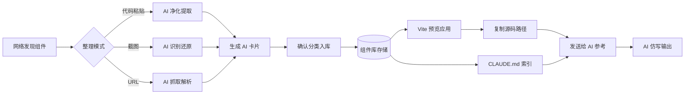
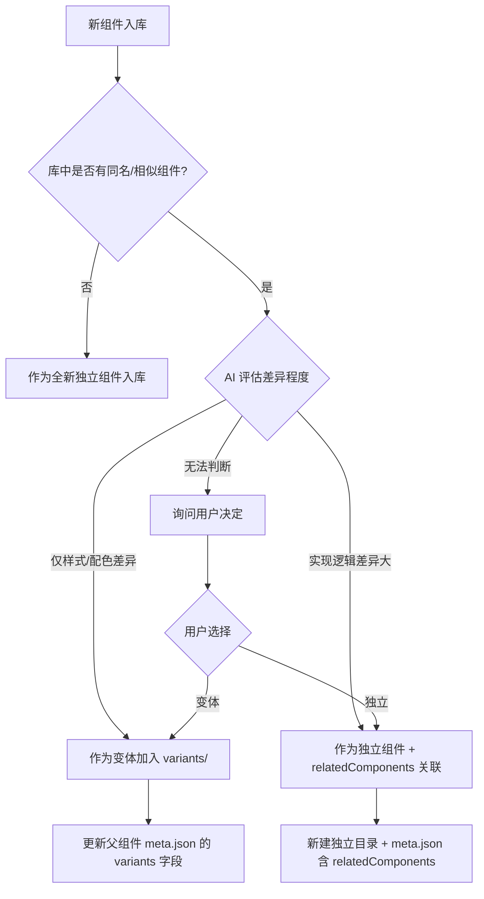
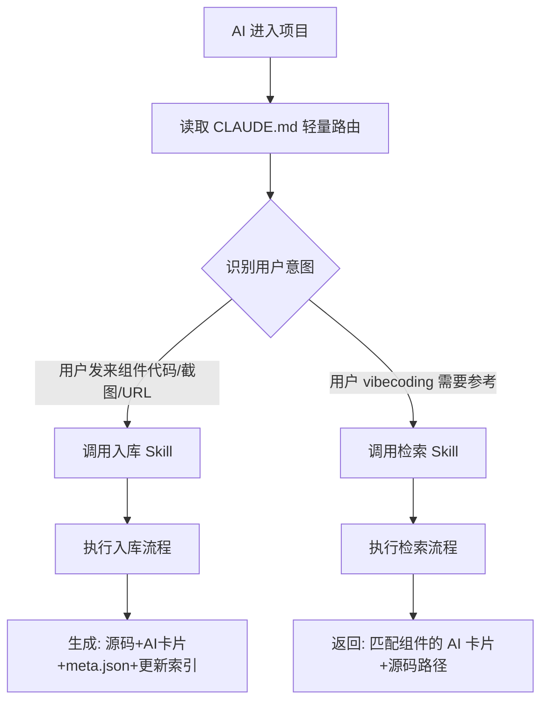
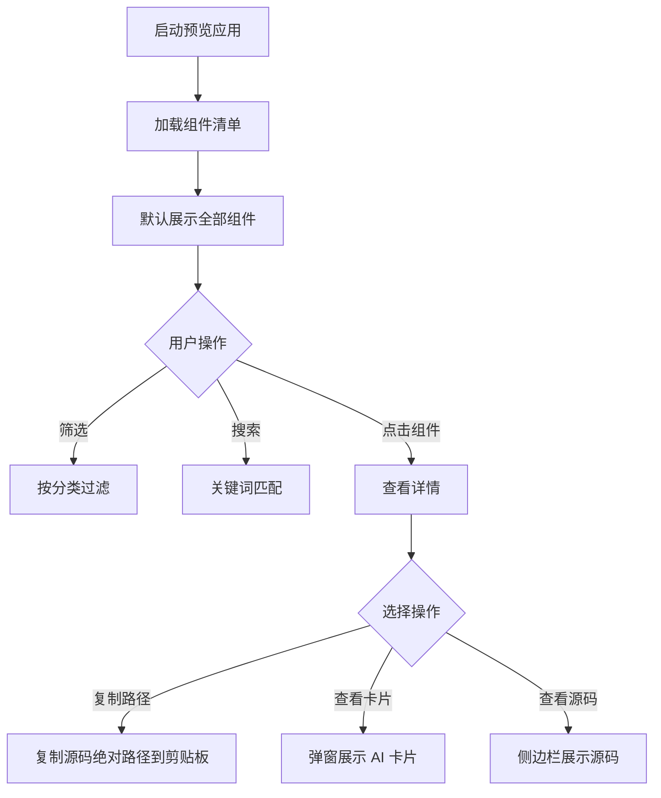

# 本地组件知识库 产品需求文档（PRD）

> **文档版本**：v0.1（骨架）
> **创建日期**：2026-06-30
> **文档状态**：待评审
> **文档作者**：产品经理视角整理

---

## 1. 项目概述

### 1.1 背景

**痛点**：在 vibecoding（AI 辅助编码）过程中，AI 直接输出的组件效果不佳——样式粗糙、交互僵硬、动效缺失。根源在于 AI 缺乏高质量的本地参考素材，仅凭描述难以复刻网络上的优秀组件。

**契机**：用户在网络浏览时经常会看到优秀的组件，但缺乏系统化的收集、整理与检索机制，导致这些素材散落各处，无法被 AI 有效利用。

### 1.2 目标

构建一个**本地组件知识库**，类比 Obsidian 个人知识库，实现「**收集 → 整理 → 预览 → 给 AI 参考**」的完整闭环，让 AI 在生成组件时能精准参考本地高质量素材，显著提升输出质量。

### 1.3 核心价值

| 价值维度 | 说明 |
|---------|------|
| **质量提升** | AI 参考本地组件后，输出从「凭空生成」升级为「仿写优化」 |
| **上下文节约** | 通过 AI 卡片摘要机制，避免直接喂入完整源码占用上下文 |
| **资产沉淀** | 个人组件资产持续积累，越用越强 |
| **跨会话复用** | 通过 CLAUDE.md 索引 + 文件路径引用，打破会话限制 |

### 1.4 名词约定

- **组件（Component）**：可复用的 UI 单元，含源码 + 元数据 + 预览
- **AI 卡片（AI Card）**：每个组件的精简摘要文件，供 AI 快速理解
- **CLAUDE.md**：项目根目录的索引文件，AI 进入项目时自动读取
- **Skill**：封装检索逻辑的项目级技能（第二期实现）

---

## 2. 用户画像与使用场景

### 2.1 用户画像

**主要用户**：个人开发者（vibecoding 实践者）
- 熟悉前端开发，但希望 AI 承担更多编码工作
- 审美在线，对组件视觉效果有要求
- 不愿长期在同一会话中维护组件库

### 2.2 核心使用场景

**场景 A：发现优秀组件**
> 用户在 21st.dev、Magic UI、CodePen 等平台看到心仪组件 → 复制代码/截图/URL → 发送给 AI → AI 整理入库 → 自动生成 AI 卡片

**场景 B：vibecoding 时参考组件**
> 用户在新会话中开发项目 → AI 读取 CLAUDE.md 索引 → 用户告知需求 → AI 检索匹配组件 → 读取 AI 卡片 → 必要时读取源码 → 仿写适配

**场景 C：本地预览选型**
> 用户启动 Vite 预览应用 → 分类筛选/搜索 → 找到合适组件 → 一键复制源码路径 → 粘贴给 AI 让其参考

### 2.3 工作流总览



---

## 3. 功能需求

### 3.1 组件收集与整理

**支持三种收集模式**（用户已确认全要）：

| 模式 | 输入 | AI 处理 | 适用场景 |
|------|------|---------|---------|
| **代码粘贴模式** | 用户粘贴原始组件代码 | 净化去杂、提取依赖、规范命名 | 从 21st.dev/Magic UI 复制源码 |
| **截图模式** | 用户上传组件截图 | 视觉识别还原为代码 | 看到 Dribbble/Twitter 设计稿 |
| **URL 抓取模式** | 用户提供页面 URL | 抓取页面、提取目标组件 | 看到 CodePen/博客演示 |

**整理流程**（推荐：AI 整理 + 用户确认分类）：

1. AI 接收输入 → 自动识别技术栈与依赖
2. AI 净化代码（详见 [净化规则](#311-净化规则定稿基于-21st-真实样本)）
3. AI 生成 AI 卡片（元数据 + 使用示例 + 关键 API）
4. AI 推荐分类目录与变体关系（用户可调整）
5. 用户确认 → 入库
6. AI 自动更新索引

#### 3.1.1 净化规则定稿（基于 21st 真实样本）

> 本规则基于分析 [21st Neural Access Login](https://21st.dev/community/components/shivendra9795kumar/neural-access-login/default) 组件后定稿。该样本特征：React + TypeScript、内联 `<style>` + CSS 变量、纯 CSS 动画 + JS 视差、SVG gooey filter、无 Props 硬编码、代码压缩在一行。

**L1 必须移除**（业务污染）

- `console.log` / `debugger` / 测试代码
- 硬编码 API 地址、token、用户 ID
- 业务特定的环境检测代码
- 与组件无关的第三方分析代码

**L2 必须保留**（组件灵魂）

- 核心样式（含 CSS 变量、keyframes 动画）
- 核心交互逻辑（鼠标视差、动画控制、事件监听）
- 特殊技术实现（SVG filter、Canvas 绘制、WebGL）
- TypeScript 类型定义
- 防御性编程逻辑（如 `useMemo` 防 hydration 错误）

**L3 规范化**（统一格式）

- 用 Prettier 统一格式（解决 21st 组件代码压缩问题）
- 目录改 kebab-case，组件名改 PascalCase
- Google Fonts 在线导入：**保留**，card.md 标注字体依赖
- 硬编码文案：提取为 Props（如 `title`、`placeholder`）
- 硬编码颜色：提取为 Props 或保留 CSS 变量
- 文件头注释：来源、原作者、入库日期、原始 URL
- 依赖写入 meta.json，不留在组件内 import 业务模块

**净化示例**（基于 Neural Access Login）

```
原组件问题：
- 代码压缩在一行 → Prettier 格式化
- 硬编码 "NEURAL ACCESS" → 提取为 title Prop
- 硬编码 "User Identity" → 提取为 label Prop
- Google Fonts 在线导入 → 保留，card.md 标注
- SVG gooey filter → 保留（核心效果）
- useMemo 防 hydration → 保留（防御性逻辑）
```

### 3.2 组件存储与分类

**多技术栈混合存储**，按技术栈顶层隔离：

- React + TypeScript
- 原生 HTML/CSS/JS
- Vue 3 + TypeScript
- 动效/可视化（Three.js / Canvas / SVG）

**组件粒度分类**（用户已确认）：

- UI 基础组件（按钮、输入框、Modal 等）
- 业务组件块（卡片、导航、表单组等）
- 动效/交互效果（悬停、滚动、过渡等）

**预装依赖**（避免 AI 参考时缺库）：

- `framer-motion`（即 `motion`）
- `gsap`
- `lottie-react`
- `three.js` / `@react-three/fiber`

> 详细目录结构见 [第 5.2 节](#52-目录结构设计)。

### 3.3 变体混合方案（独立组件 + 多变体关联）

**核心策略**：入库时 AI 判断新组件与已有组件的差异程度，决定作为"变体"还是"独立组件 + 关联"。

#### 判断逻辑



#### 目录结构示例

```
library/react/ui-basic/
├── button/                      # 按钮组件（多变体）
│   ├── index.tsx                # 基础按钮（可选）
│   ├── variants/
│   │   ├── glow.tsx             # 发光变体（小差异）
│   │   ├── gradient.tsx         # 渐变变体（小差异）
│   │   └── neon.tsx             # 霓虹变体（小差异）
│   ├── card.md                  # 统一卡片，含所有变体说明
│   └── meta.json                # 含 variants 列表
│
├── button-magnetic/             # 磁吸按钮（独立，实现差异大）
│   ├── index.tsx
│   ├── card.md
│   └── meta.json                # relatedComponents: ["button"]
```

#### 预览应用适配

- 变体组件卡片显示"3 个变体"徽章
- 点击卡片进入详情页，可切换变体预览
- 详情页侧边栏展示"关联组件"

#### 检索 Skill 适配

```
用户："找按钮组件"
→ 返回 button 组件（含 3 变体）+ button-magnetic（关联）

用户："只要发光的"
→ 返回 button 的 glow 变体
```

### 3.4 标签体系（多维自动生成）

**设计理念**：标签不约束，要发散——让 AI 尽量发掘组件的所有标签，激发用户灵感。

#### 六维标签体系

入库 Skill 自动从 6 个维度生成标签，每维度至少 2 个，总标签数目标 8-15 个：

| 维度 | 示例标签 | 目的 |
|------|---------|------|
| **功能** | button, input, modal, nav, login | 描述"是什么" |
| **风格** | glow, gradient, glassmorphism, neon, minimal | 描述"视觉风格" |
| **情绪** | energetic, calm, playful, serious, mysterious | 描述"情感氛围" |
| **场景** | cta, hero, onboarding, dashboard, auth | 描述"用在哪" |
| **技术** | framer-motion, gsap, css-only, svg-filter, canvas | 描述"技术实现" |
| **灵感** | futuristic, retro, organic, geometric, cyberpunk | 描述"设计灵感" |

#### 标签示例（基于 Neural Access Login）

```
功能: login, form, auth, input
风格: minimal, monochrome, dark
情绪: mysterious, immersive, serious
场景: auth, onboarding, hero
技术: css-keyframes, svg-filter, js-parallax, css-variables
灵感: cyberpunk, futuristic, scifi, liquid, organic
```

#### 防泛滥机制

- **不限制数量**，鼓励发散
- **归一化处理**：`btn`→`button`，`BTN`→`button`，`按钮`→`button`
- **中英文双语**：生成英文标签为主，中文标签为辅（避免检索时遗漏）
- **标签云视图**（第二期）：预览应用展示标签分布，字体大小代表使用频率

#### 检索 Skill 利用标签

```
用户："我想要赛博朋克风格的按钮"
→ 匹配 cyberpunk + button，跨类别返回

用户："给我一些未来感的东西"
→ 匹配 futuristic，返回所有相关组件

用户："登录页面需要点灵感"
→ 匹配 login + auth + onboarding，返回登录类组件
```

### 3.5 AI 参考机制

**架构：CLAUDE.md 轻量路由 + 双 Skill 按需加载**

核心设计思想：CLAUDE.md 极简（只做分发），具体逻辑封装到两个 Skill 中按需加载，最大限度节约上下文与 token 消耗。



#### 组件 1：AI 卡片（组件级摘要，存储层）

每个组件维护一个 `card.md` 文件，包含：
- 元数据（技术栈、依赖、分类、标签）
- 视觉描述（供 AI 理解外观）
- 关键 API / Props
- 最小使用示例
- 源码相对路径指引

> 模板见 [第 6.1 节](#61-ai-卡片模板)。AI 卡片是入库 Skill 的产物，也是检索 Skill 的返回结果。

#### 组件 2：CLAUDE.md 轻量路由（第一期核心）

项目根目录维护 `CLAUDE.md`，**刻意保持精简**（目标 < 50 行），只做三件事：
1. **项目说明**：一句话告知 AI 这是组件知识库
2. **意图分发**：告知 AI 两个 Skill 的存在与触发条件
3. **入口指引**：指向两个 Skill 文件路径

> 模板见 [第 6.2 节](#62-claudemd-轻量路由规范)。

**为什么不把规范全写进 CLAUDE.md？**
> CLAUDE.md 每次会话都会被 AI 自动读取，若塞满规范会持续占用上下文。把详细规范放入 Skill，AI 只在需要时才读取，实现「按需加载」。

#### 组件 3：双 Skill（第一期并行搭建）

**入库 Skill**（`.claude/skills/component-ingest.md`）
- 触发：用户在对话中发来组件代码 / 截图 / URL
- 职责：执行完整入库流程
  1. 识别技术栈与依赖
  2. 净化代码（移除业务无关逻辑、统一格式）
  3. 生成 AI 卡片（元数据 + 使用示例 + 关键 API）
  4. 创建 meta.json
  5. 推荐分类目录（用户确认）
  6. 更新 CLAUDE.md 索引清单
- 支持三种输入模式：代码粘贴 / 截图识别 / URL 抓取

**检索 Skill**（`.claude/skills/component-search.md`）
- 触发：用户 vibecoding 时描述需求，AI 需要找参考组件
- 职责：执行检索流程
  1. 关键词匹配 meta.json 的 tags 字段
  2. 按 category 分类筛选
  3. 读取候选组件的 card.md
  4. 返回匹配组件的 AI 卡片 + 源码相对路径
  5. 必要时读取源码仿写

**触发方式**：对话自动触发 + 显式调用（如 `/入库组件` `/检索组件`）均支持。

### 3.4 预览 Web 应用

**形态**：本地 Vite 开发服务器（用户已确认）

**核心功能**：

| 功能 | 说明 | 优先级 |
|------|------|--------|
| 组件展示 | 网格/列表双视图，实时渲染预览 | P0 |
| 分类筛选 | 按技术栈/粒度/标签多层筛选 | P0 |
| 全文搜索 | 搜索组件名、描述、标签 | P0 |
| 复制源码路径 | 一键复制绝对路径，发给 AI | P0 |
| 查看 AI 卡片 | 弹窗展示组件的 AI 卡片内容 | P0 |
| 亮/暗主题切换 | 预览组件在两种主题下的表现 | P1（暂不选） |

**交互流程**：



---

## 4. 非功能需求

### 4.1 性能

- 预览应用启动时间 < 3 秒
- 组件清单加载支持懒加载（组件超过 50 个时）
- 全文搜索响应 < 200ms

### 4.2 可维护性

- 组件入库流程标准化（AI 卡片必填字段校验）
- 目录命名规范统一（kebab-case）
- CLAUDE.md 索引可自动生成（第二期 Skill 实现）

### 4.3 兼容性

- 预览应用支持现代浏览器（Chrome/Edge 最新版）
- 组件源码兼容 Node 18+ / Vite 5+

---

## 5. 技术架构

### 5.1 技术栈选型

| 层级 | 选型 | 理由 |
|------|------|------|
| 预览应用框架 | **Vite + React + TypeScript** | 启动快、HMR、生态成熟 |
| UI 库 | shadcn/ui（可选） | 预览应用自身的 UI |
| 路由 | React Router | 组件详情页路由 |
| 搜索 | flexsearch（轻量） | 本地全文检索 |
| 组件渲染 | 动态 import + React.lazy | 按需加载组件预览 |
| 文档生成 | Vitepress（备选） | 若需静态站点导出 |

### 5.2 目录结构设计

```
c:\000\code\design\
├── CLAUDE.md                      # AI 全局索引（第一期核心）
├── package.json
├── vite.config.ts
├── tsconfig.json
├── docs/                          # 文档目录
│   ├── PRD.md                     # 本文档
│   ├── ai-card-template.md        # AI 卡片模板
│   └── contributing.md            # 组件贡献指南
├── src/                           # 预览应用源码
│   ├── App.tsx
│   ├── main.tsx
│   ├── components/                # 预览应用自身组件
│   │   ├── ComponentGrid.tsx
│   │   ├── ComponentCard.tsx
│   │   ├── FilterBar.tsx
│   │   └── SearchBox.tsx
│   ├── pages/
│   │   ├── HomePage.tsx           # 组件列表页
│   │   └── DetailPage.tsx         # 组件详情页
│   ├── lib/
│   │   ├── registry.ts            # 组件清单自动扫描
│   │   └── search.ts              # 搜索逻辑
│   └── styles/
├── library/                       # 组件库核心存储
│   ├── react/                     # React 技术栈
│   │   ├── ui-basic/              # UI 基础组件
│   │   │   └── button-glow/
│   │   │       ├── index.tsx      # 组件源码
│   │   │       ├── preview.tsx    # 预览入口
│   │   │       ├── card.md        # AI 卡片
│   │   │       └── meta.json      # 元数据
│   │   ├── business/              # 业务组件块
│   │   └── effects/               # 动效组件
│   ├── html/                      # 原生 HTML/CSS/JS
│   │   ├── ui-basic/
│   │   ├── business/
│   │   └── effects/
│   ├── vue/                       # Vue 3
│   │   ├── ui-basic/
│   │   ├── business/
│   │   └── effects/
│   └── visualization/             # 动效/可视化
│       ├── three/
│       ├── canvas/
│       └── svg/
├── scripts/
│   └── scan-components.ts         # 扫描组件生成清单
└── .claude/
    └── skills/                    # 第一期：项目级 Skill
        ├── component-ingest.md    # 入库 Skill
        └── component-search.md    # 检索 Skill
```

**命名规范**：

- 组件目录：`kebab-case`（如 `button-glow`）
- 源码入口：统一 `index.tsx` / `index.html` / `index.vue`
- 预览入口：统一 `preview.tsx`（供预览应用渲染）
- AI 卡片：统一 `card.md`
- 元数据：统一 `meta.json`
- 变体文件：`variants/{variant-name}.tsx`

### 5.3 数据模型

**meta.json 结构（极简版，第一期不含 version/归档字段）**：

```json
{
  "id": "react-ui-basic-button",
  "name": "按钮组件",
  "techStack": "react",
  "styling": "css-modules",
  "animation": "framer-motion",
  "category": "ui-basic",
  "tags": ["button", "glow", "gradient", "neon", "interactive", "futuristic"],
  "variants": [
    {"name": "glow", "file": "variants/glow.tsx", "description": "悬停发光效果"},
    {"name": "gradient", "file": "variants/gradient.tsx", "description": "渐变背景"}
  ],
  "relatedComponents": ["react-ui-basic-button-magnetic"],
  "dependencies": ["framer-motion"],
  "fonts": ["Inter", "Space Mono"],
  "source": "21st.dev",
  "sourceUrl": "https://21st.dev/xxx",
  "author": "原作者",
  "createdAt": "2026-06-30",
  "updatedAt": "2026-06-30"
}
```

---

## 6. AI 协作规范

### 6.1 AI 卡片模板

> 完整模板见 [`docs/ai-card-template.md`](./ai-card-template.md)，核心结构如下：

```markdown
---
id: react-ui-basic-button-glow
name: 发光按钮
techStack: react
category: ui-basic
tags: [button, glow, animation]
dependencies: [framer-motion]
source: 21st.dev
---

# 发光按钮

## 视觉描述
悬停时产生柔和发光效果，按钮边缘有渐变光晕。

## 关键 API
| Prop | 类型 | 默认值 | 说明 |
|------|------|--------|------|
| color | string | '#3b82f6' | 发光颜色 |
| intensity | number | 1 | 发光强度 |

## 最小使用示例
\`\`\`tsx
import { GlowButton } from '@/library/react/ui-basic/button-glow';

<GlowButton color="#3b82f6">点击我</GlowButton>
\`\`\`

## 源码路径
`library/react/ui-basic/button-glow/index.tsx`（相对路径，AI 读取时自动拼接项目根）

## 适用场景
- CTA 按钮
- 主操作按钮
- 需要强调的交互元素
```

### 6.2 CLAUDE.md 轻量路由规范

> 完整模板见项目根目录 `CLAUDE.md`，**刻意保持精简**（目标 < 50 行），核心结构如下：

```markdown
# 本地组件知识库

本项目是个人组件知识库，供 AI 在 vibecoding 时参考本地高质量组件素材。

## 两个 Skill（按需调用，勿全量读取）

### 入库 Skill
- 触发：用户发来组件代码 / 截图 / URL
- 路径：.claude/skills/component-ingest.md
- 调用时机：识别到用户想"整理/收录/保存这个组件"时

### 检索 Skill
- 触发：用户 vibecoding 描述需求，需要参考组件
- 路径：.claude/skills/component-search.md
- 调用时机：识别到用户想"找组件/参考/看看有没有合适的"时

## 目录结构速览
- library/react/         - React 组件
- library/html/          - 原生 HTML 组件
- library/vue/           - Vue 组件
- library/visualization/ - 可视化组件

## 组件存储结构（每个组件目录）
- index.tsx / index.html / index.vue  - 源码
- preview.tsx                          - 预览入口
- card.md                              - AI 卡片（摘要）
- meta.json                            - 元数据

## 重要约定
- AI 卡片内源码路径用**相对路径**，勿用绝对路径
- 详细规范见对应 Skill 文件，按需读取
```

**设计原则**：
- CLAUDE.md 只做"路标"，不做"说明书"
- 具体规范全部下沉到 Skill 文件
- AI 读取 CLAUDE.md 后，根据用户意图选择性读取对应 Skill

### 6.3 双 Skill 规范

#### 入库 Skill（`.claude/skills/component-ingest.md`）

**核心职责**：将用户发来的组件素材整理入库

**完整流程**：
1. **识别输入类型**
   - 代码粘贴 → 直接进入净化
   - 截图 → 视觉识别还原为代码
   - URL → 抓取页面提取目标组件
2. **识别技术栈与依赖**
   - 检测 React / Vue / HTML / 可视化
   - 提取依赖（framer-motion / gsap / three 等）
3. **净化代码**
   - 移除业务无关逻辑
   - 统一格式（Prettier 规范）
   - 规范命名（kebab-case 目录，PascalCase 组件名）
4. **生成 AI 卡片**（card.md）
   - 填写元数据 frontmatter
   - 撰写视觉描述
   - 提取关键 API / Props
   - 编写最小使用示例
   - 填写源码相对路径
5. **创建 meta.json**
6. **推荐分类目录**（用户确认）
   - 按 techStack + category 推荐
   - 用户可调整
7. **更新 CLAUDE.md 索引清单**（若有优秀组件推荐位）
8. **告知用户入库结果**

**输出物**：
- `library/{techStack}/{category}/{component-name}/index.tsx`
- `library/{techStack}/{category}/{component-name}/preview.tsx`
- `library/{techStack}/{category}/{component-name}/card.md`
- `library/{techStack}/{category}/{component-name}/meta.json`

#### 检索 Skill（`.claude/skills/component-search.md`）

**核心职责**：根据用户需求检索匹配组件

**完整流程**：
1. **解析用户需求关键词**
   - 提取功能词（如"按钮""表单""导航"）
   - 提取风格词（如"发光""玻璃态""暗色"）
   - 提取情绪词（如"赛博朋克""未来感""活泼"）
   - 提取技术栈偏好（如"React""带动画"）
2. **同义词扩展**
   - 查询同义词词典（`src/lib/synonyms.json`）
   - 如"按钮"→`button`/`btn`，"输入框"→`input`/`textfield`
3. **扫描 library/ 目录**
   - 读取所有 meta.json
   - 按多维度加权评分排序（详见下方算法）
4. **读取 Top 5 候选组件的 card.md**
   - 匹配视觉描述与适用场景
5. **返回结果**
   - 优先返回 AI 卡片摘要（节约上下文）
   - 附带源码相对路径
   - 说明匹配理由（"因为 tags 命中 button + glow"）
   - 必要时读取源码仿写
6. **若无可匹配组件**
   - 告知用户库中暂无匹配
   - 提供最接近的 2-3 个组件（即使分数低）
   - 建议用户收集后入库

**多维度加权评分算法**：

```
总分 = tags命中数 × 3 + category匹配 × 2 + 技术栈匹配 × 2 + 视觉描述关键词重叠 × 1
```

| 维度 | 权重 | 匹配规则 |
|------|------|---------|
| tags 命中 | ×3 | 精确匹配 + 同义词扩展，命中数越多分越高 |
| category 匹配 | ×2 | 完全匹配得 2 分，不匹配得 0 分 |
| 技术栈匹配 | ×2 | 用户项目是 React 则 react 组件优先 |
| 视觉描述重叠 | ×1 | card.md 视觉描述中的关键词重叠数 |

**返回数量**：默认 Top 5，用户说"再多几个"扩展到 10

**返回格式**：
```
找到 N 个匹配组件（按相关度排序）：
1. [组件名] - [一句话描述]
   匹配理由：tags 命中 button + glow + cyberpunk
   卡片：library/.../card.md
   源码：library/.../index.tsx
2. ...
```

**同义词词典**（`src/lib/synonyms.json`，第一期维护约 50 个常见词）：

```json
{
  "button": ["按钮", "btn", "按键"],
  "input": ["输入框", "textfield", "输入"],
  "modal": ["弹窗", "对话框", "dialog"],
  "nav": ["导航", "navigation", "菜单"],
  "login": ["登录", "signin", "auth"],
  "glow": ["发光", "光晕", "荧光"],
  "gradient": ["渐变", "过渡色"],
  "cyberpunk": ["赛博朋克", "赛博"],
  "futuristic": ["未来感", "未来", "科幻"]
}
```

### 6.4 Skill 演进路径

**第一期**（当前）：搭建双 Skill 骨架（流程框架 + 触发规则）
**第二期**：完善 Skill 细节（截图识别优化、URL 抓取健壮性、检索排序算法）
**第三期**（可选）：自动维护索引、组件版本管理、依赖关系图

---

## 7. 实施路线图

### 7.1 第一期：骨架搭建（当前阶段）

**目标**：跑通「存储 → 预览 → AI 参考（入库+检索）」最小闭环

**分三个工作流并行推进**：

#### 工作流 A：项目基建
| 序号 | 任务 | 交付物 | 状态 |
|------|------|--------|------|
| A1 | 初始化 Vite + React 项目 | `package.json` / `vite.config.ts` | ☐ 待开始 |
| A2 | 创建目录骨架 | `library/` 完整结构（含 variants/ 规范） | ☐ 待开始 |
| A3 | 预装动画库依赖 | `framer-motion` / `gsap` / `lottie-react` / `three` | ☐ 待开始 |

#### 工作流 B：AI 协作层（核心）
| 序号 | 任务 | 交付物 | 状态 |
|------|------|--------|------|
| B1 | 编写 CLAUDE.md 轻量路由 | 根目录 `CLAUDE.md`（< 50 行） | ☐ 待开始 |
| B2 | 编写入库 Skill 骨架 | `.claude/skills/component-ingest.md`（含净化规则、变体判断、六维标签生成） | ☐ 待开始 |
| B3 | 编写检索 Skill 骨架 | `.claude/skills/component-search.md`（含多维度加权评分、同义词扩展） | ☐ 待开始 |
| B4 | 编写 AI 卡片模板 | `docs/ai-card-template.md` | ☐ 待开始 |
| B5 | 编写同义词词典 | `src/lib/synonyms.json`（约 50 个常见词） | ☐ 待开始 |

#### 工作流 C：预览应用
| 序号 | 任务 | 交付物 | 状态 |
|------|------|--------|------|
| C1 | 编写组件清单扫描脚本 | `scripts/scan-components.ts` | ☐ 待开始 |
| C2 | 实现预览应用核心页面 | `src/pages/HomePage.tsx` | ☐ 待开始 |
| C3 | 实现分类筛选与搜索 | `src/components/FilterBar.tsx` | ☐ 待开始 |
| C4 | 实现复制源码路径功能 | 剪贴板 API | ☐ 待开始 |
| C5 | 实现查看 AI 卡片功能 | 弹窗展示 card.md | ☐ 待开始 |
| C6 | 实现变体切换预览 | 详情页支持 variants/ 切换 | ☐ 待开始 |
| C7 | 实现关联组件展示 | 详情页侧边栏展示 relatedComponents | ☐ 待开始 |

#### 验证里程碑
| 序号 | 任务 | 验证点 | 状态 |
|------|------|--------|------|
| V1 | 录入第一个示例组件 | 验证入库 Skill 全流程 | ☐ 待开始 |
| V2 | 检索该示例组件 | 验证检索 Skill 全流程 | ☐ 待开始 |
| V3 | 预览应用展示该组件 | 验证预览全链路 | ☐ 待开始 |

### 7.2 第二期：Skill 完善与体验优化（后续迭代）

- 入库 Skill：截图识别优化、URL 抓取健壮性
- 检索 Skill：检索排序算法、相关性评分
- 预览应用：暗色主题、组件收藏、版本管理
- 自动维护 CLAUDE.md 索引

---

## 8. 已确认事项（评审结论）

> 以下问题已在 PRD 评审中确认：

| 序号 | 问题 | 结论 |
|------|------|------|
| 1 | 预览应用暗色主题切换？ | 暂不做（第二期） |
| 2 | Vue 组件在 React 预览应用中如何渲染？ | iframe 隔离渲染，React 组件直接动态 import |
| 3 | 多技术栈依赖冲突？ | 固定版本范围，Vue 装 `@vitejs/plugin-vue`，冲突时 iframe 沙箱隔离 |
| 4 | AI 卡片源码路径用绝对还是相对？ | **相对路径**（迁移友好） |
| 5 | 组件入库输入入口？ | 第一期对话粘贴，第二期考虑预览应用内录入界面 |
| 6 | 截图模式图片存储？ | 单张存 `preview.png`，多张存 `screenshots/` 目录 |
| 7 | 全文搜索数据源？ | meta.json 的 name/tags + card.md 的视觉描述 + 适用场景 |
| 8 | Vue 目录是否保留？ | 保留空目录，第一期不录入 Vue 组件 |
| 9 | Skill 目标环境？ | Claude Code 项目级 Skill（`.claude/skills/`） |
| 10 | 第一个示例组件？ | React 发光按钮（用 framer-motion），验证全链路 |
| 11 | CLAUDE.md 与 Skill 职责划分？ | **CLAUDE.md 做轻量路由，双 Skill 承载具体逻辑** |
| 12 | Skill 触发方式？ | 对话自动触发 + 显式调用均支持 |
| 13 | 净化代码规则？ | **三层净化策略（L1移除/L2保留/L3规范化），基于 21st 真实样本定稿** |
| 14 | 检索算法？ | **多维度加权评分**（tags×3 + category×2 + 技术栈×2 + 视觉描述×1）+ 同义词扩展 |
| 15 | 组件变体处理？ | **混合方案**：AI 判断差异程度，小差异→variants/，大差异→独立+relatedComponents |
| 16 | 标签管理？ | **六维自动生成**（功能/风格/情绪/场景/技术/灵感），8-15 个，不限制数量 |
| 17 | 标签云视图？ | 第二期做，预览应用展示标签分布 |
| 18 | 依赖可视化？ | **不做**，在 card.md 加依赖说明栏 |
| 19 | 技术栈标注？ | **多维度拆分**：techStack / styling / animation / fonts |
| 20 | version 字段？ | **第一期不做**，git 已够，meta.json 只留 createdAt/updatedAt |
| 21 | 归档机制？ | **第一期不做**，手动删除或移到 `library/_archive/` |
| 22 | 检索返回数量？ | 默认 Top 5，可扩展到 10 |
| 23 | 无结果兜底？ | 提供最接近的 2-3 个组件 + 建议收集入库 |

## 9. 待确认事项

> 第一期骨架搭建无阻塞项，以下为实施过程中可能微调的细节：

| 序号 | 问题 | 倾向方案 | 备注 |
|------|------|---------|------|
| 1 | 同义词词典初始收录哪些词？ | 约 50 个常见组件词，实施时填充 | 非阻塞 |
| 2 | 预览应用 iframe 隔离的具体实现？ | srcdoc 或独立路由，实施时验证 | 非阻塞 |
| 3 | 变体判断的"差异程度"如何量化？ | 第一期靠 AI 判断 + 用户确认，第二期加算法 | 非阻塞 |

---

## 附录 A：相关文档

- [`docs/ai-card-template.md`](./ai-card-template.md) - AI 卡片完整模板
- [`CLAUDE.md`](../CLAUDE.md) - 项目根目录索引文件
- [`docs/contributing.md`](./contributing.md) - 组件贡献指南（待编写）

## 附录 B：术语表

| 术语 | 含义 |
|------|------|
| vibecoding | AI 辅助编码的工作方式 |
| AI 卡片 | 组件的精简摘要文件 |
| HMR | Hot Module Replacement，热模块替换 |
| kebab-case | 短横线命名法，如 `button-glow` |
